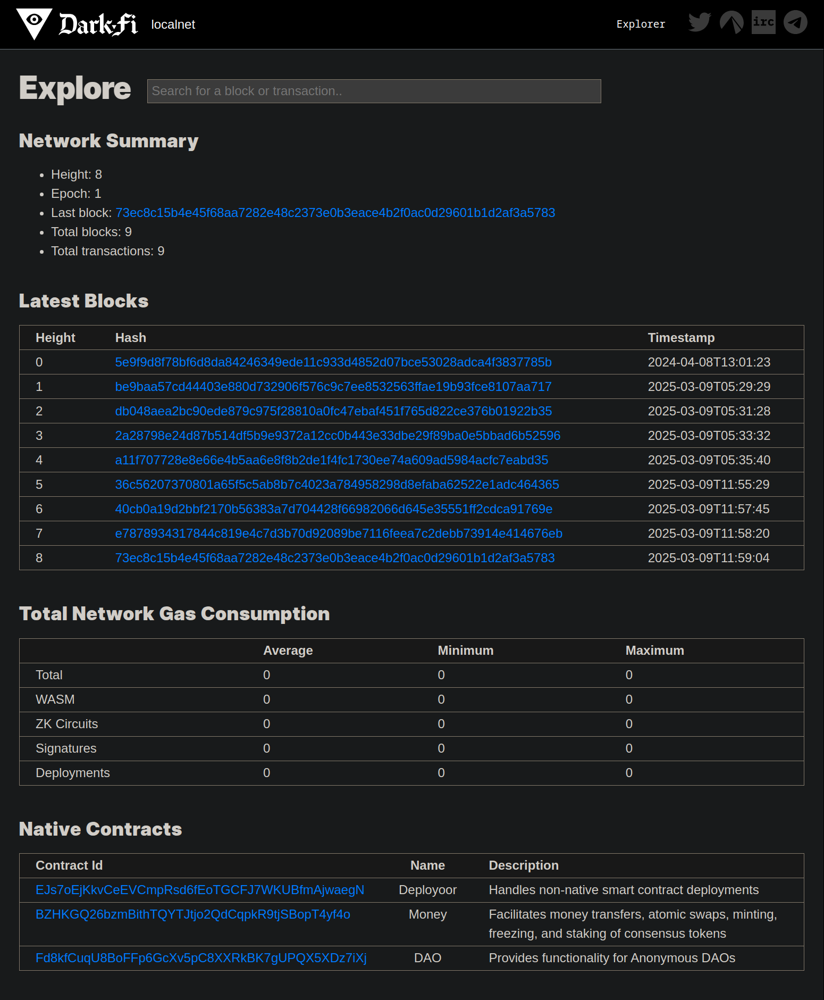

# DarkFi Blockchain Explorer

The DarkFi Blockchain Explorer facilitates the exploration of chain data and interaction with the DarkFi blockchain. It provides detailed insights into block and transaction activity, gas usage metrics, and native contract source code. 

## Table of Contents
1. [Key Features](#key-features)
2. [Network Status](#network-status)
3. [Quick Start Guide](#quick-start-guide)

4. [Explorer Components](#explorer-components)
    - [Explorer Nodes](#explorer-nodes)
    - [Explorer Site](#explorer-site)

5. [Configuration](#configuration)
    - [Configuration Files](#configuration-files)
    - [Supported Networks](#supported-networks)

6. [Feature Details](#feature-details)
    - [Home Page Overview](#home-page-overview)
    - [Block and Transaction Exploration](#block-and-transaction-exploration)
    - [Gas Analytics](#gas-analytics)
        - [Network-Wide Gas Consumption Metrics](#network-wide-gas-consumption-metrics)
        - [Transaction-Level Gas Consumption Metrics](#transaction-level-gas-consumption-metrics)
    - [Native Contract Source Code Navigation](#native-contract-source-code-navigation)

## Key Features
- **DarkFi Blockchain Synchronization**: Ensures real-time synchronization of blockchain data, providing an accurate and unified view of DarkFi activity across supported networks.
- **Blockchain Data Exploration**: Access detailed information about blocks and transactions.
- **Gas Analytics**: Analyze gas usage metrics at both the network level and on a per-transaction basis.
- **Native Contract Source Code Access**: Review the implementation details of native contract source code for improved transparency.
- **Search Blocks and Transactions**: Locate specific blocks or transactions using search.

## Network Status

The testnet and mainnet configurations serve as placeholders in preparation for their respective launch. When starting environment with these environment configurations , the site will connect to an Explorer Node that point to their respective darkfid networks, but currently only display the network's genesis block.

In addition, testnet and mainnet configurations are currently using development servers for the site and work is ongoing for production-like setups.

## Quick Start Guide

The DarkFi Explorer provides a visual interface to explore blockchains on DarkFi networks. Follow the steps below to launch explorer environments for your desired Darkfi blockchain network. 

### Prerequisites
Before you begin, ensure you have the following installed and configured:
- **Rust 1.86 or later**: Required for building components written in Rust (like `darkfid`, `explorerd`)
- **Python 3.12**: Required for building and running the Explorer Site (`site`).
- **Darkfi Project Dependencies**: System dependencies required to compile Darkfi code. For details, see [Darkfi Build Dependencies](../../README.md#build).
- **Darkfid**: Runs DarkFi blockchain nodes on respective networks.

> **Note** When using the `make` commands in the [Quick Start Guide](#quick-start-guide), Darkfid is automatically built when needed.

### Start Localnet Explorer Environment

```sh
# Launch an explorer environment using the localnet configuration  
make start-localnet
```

### Start Testnet Explorer Environment

```sh
# Launch an explorer environment using the latest testnet configuration 
make start-testnet
```

### Start Mainnet Explorer Environment

```sh
# Launch an explorer environment using the latest mainnet configuration 
make start-mainnet
```

### Start Explorer Environment in No-Sync Mode
An explorer environment can be started in a no-sync mode that does not connect a darkfi blockchain network or sync new blocks, allowing you to work with an existing local explorer database. This feature is particularly useful for UI development, testing, development tasks that don't require syncing, or exploring functionality without the overhead of running a blockchain network.

Below is an example of how to launch a no-sync environment configured for localnet. You can also start testnet or mainnet similarly (using `start-no-sync-testnet` or `start-no-sync-mainnet`):

```sh
# Launch localnet explorer environment without connecting or syncing with a Darkfi blockchain network
make start-no-sync-localnet
```

> **Note** Once started, navigate to http://127.0.0.1:5000 in your browser to access the explorer interface.

### Confirming Successful Start

Upon successful initialization of the Explorer environment, confirmation messages will appear in the startup logs. If these logs are not visible, the Explorer environment is still initializing. Allow sufficient time for the initialization process to complete before accessing the block explorer.

```
[INFO] ========================================================================================
[INFO]                    Started DarkFi Explorer Node
[INFO] ========================================================================================
[INFO]   - Network: localnet
[INFO]   - JSON-RPC Endpoint: tcp://127.0.0.1:14567
[INFO]   - Database: ~/.local/share/darkfi/explorerd/localnet
[INFO]   - Configuration: ./explorerd_config.toml
[INFO]   - Reset Blocks: No
[INFO] ~~~~~~~~~~~~~~~~~~~~~~~~~~~~~~~~~~~~~~~~~~~~~~~~~~~~~~~~~~~~~~~~~~~~~~~~~~~~~~~~~~~~~~~~
[INFO]   - Synced Blocks: 9
[INFO]   - Synced Transactions: 9
[INFO]   - Connected Darkfi Node: tcp://127.0.0.1:28345
[INFO] ========================================================================================
[INFO] All is good. Waiting for block notifications...
Started explorer site on localnet network (PID=31911)
Started localnet environment. Press Ctrl-C to stop.
```

> **Note** Localnet explorer site logs appear directly in the console, while testnet and mainnet logs are written to `~/.local/share/darkfi/explorer_site/{network}/app.log`. For non-localnet environments, the console displays: `See site logfile /home/user/.local/share/darkfi/explorer_site/{network}/app.log for server startup details`.
> **Note** In no-sync mode, you will see “Started DarkFi Explorer Node (No-Sync Mode)” in the banner header, and the “Connected Darkfi Node:” line will show “Not connected”.

The explorer site log contains the following statup details.
```
============================================================
Started Explorer Site
============================================================
Network: localnet
Explorer Node Endpoint: 127.0.0.1:14567
Log Path: ~/.local/share/darkfi/explorer_site/localnet
============================================================
```

### Stopping the Explorer Environment

#### Ctrl-C
To stop the environment, press the keyboard combination Ctrl-C and wait for all components to stop.

#### Make Command
You can also stop the environment using Make:
```sh
# Stop the running explorer environment (nodes and site)
make stop
```

### Getting Help
```shell
make help
```

## Explorer Components

### Explorer Nodes

DarkFi explorers rely on explorer nodes who are responsible for syncing with DarkFi blockchain networks. Explorer nodes function as background daemons, running continuously to ensure the Explorer database stays up-to-date. They synchronize with the latest blocks during startup and actively listen for new blocks using DarkFi's subscription interface. This ensures that the Explorer provides an accurate and consistent view of blockchain activity. Explorer nodes are implemented in Rust, designed to reliably handle real-world blockchain changes, including reorganizations (reorgs) and block updates, while maintaining data integrity.

For more details on explorer nodes and their functionality, see [explorerd/README.md](explorerd/README.md).

### Explorer Site

The Explorer Site is a web application that serves as the user interface for viewing DarkFi blockchain data. It provides an interactive way for users to explore blockchain information, analyze gas usage, and navigate contract source code. The site connects to explorer nodes to fetch real-time data, ensuring accurate and up-to-date information is provided.

For more details on the Explorer Site, see [site/README.md](site/README.md).

## Configuration

### Configuration Files

The Explorer uses configuration files to define `darkfid` endpoints for block synchronization, `explorerd` endpoints for retrieving blockchain data, and other settings such as log file locations. These configurations can be reviewed and updated as needed.

| Configuration File | Description                                                                                                              |
| --- |--------------------------------------------------------------------------------------------------------------------------|
| **[Darkfid Config](../darkfid/darkfid_config.toml)** | Contains darkfid network configurations for `localnet`, `testnet`, and `mainnet`.                                        |
| **[Explorerd Config](./explorerd/explorerd_config.toml)** | Specifies the `darkfid` endpoint for block synchronization and the `explorerd` endpoint for retrieving synchronized data. |
| **[ExplorerSite Config](./site/site_config.toml)** | Defines the `explorerd` endpoints for fetching synchronized data, as well as other settings for the Explorer site.|

### Supported Networks
The Explorer is configured to support the following pre-configured DarkFi blockchain networks.

| **Network**    | **Description**                                              |
| -------------- | ------------------------------------------------------------ |
| **`localnet`** | Ideal for development and testing in a local environment using `darkfid`'s localnet configuration. |
| **`testnet`**  | Used for testing the explorer with `darkfid`'s testnet network (pending availability). |
| **`mainnet`**  | The production environment for running the explorer on DarkFi's canonical chain (pending availability). |

> **Note** Once the testnet and mainnet are fully available, the explorer will sync more than just the genesis blocks for these networks.

## Feature Details

### Home Page Overview

The explorer’s home page serves as the starting point for navigating blockchain data and features. It provides a high-level overview of available resources, including:
- **Search Box**: Search for blocks and transactions based on hash.
- **At-a-Glance Summary**: View summaries of network activity, like recent blocks, native contracts, and total gas consumption.
- **Navigation Links**: Access block details and native contract source code, as well as navigate DarkFi social media links.

<details>
<summary>Click to view the Home Page</summary>

</details>

___

### Block and Transaction Exploration
The Explorer provides insights into blockchain activity by giving users the ability to view blocks, obtain transaction details, and analyze the relationships between blocks and transactions.

#### Key Features
- **Block Details Overview**: Provides key information about each block.
- **Transaction Details**: Displays details for individual transactions.
- **Search Functionality**: Enables users to locate specific blocks or transactions using the Explorer's search tools.
- **Detail Navigation**: Allows users to navigate into block-level details from the Block Explorer home page or view transaction details from within blocks.

#### Block Details
The Explorer presents detailed information about each block, offering insights into the transactions it contains and other metadata. Below, you’ll find an example of the block details view.


The detailed block view displays the following details.

| **Field** | **Description** |
| --- | --- |
| **Version** | Indicates the block's version. |
| **Previous Block** | A navigable link to the previous block's hash. |
| **Block Hash** | The unique identifier of the block. |
| **Block Height** | The block's position within the blockchain. |
| **Timestamp** | The UTC time at which the block was created. |
| **Nonce** | The proof-of-work or equivalent nonce value for the block. |
| **Root** | The Merkle root summarizing the hashes of all transactions. |
| **Signature** | The digital signature of the block. |
| **Transactions** | List of transaction hashes, each navigable for detailed views. |

#### Transaction Details

The Explorer provides an in-depth view of individual transactions, whether accessed from a block's detailed view or using the search functionality. Below is an example of the transaction details view.


For each transaction, the Explorer displays the following details.

| **Field** | **Description** |
| --- | --- |
| **Transaction Hash** | A unique identifier for the transaction. |
| **Block** | The hash of the containing block, linking back to the block’s details. |
| **Payload** | Call data associated with the transaction. |
| **Gas Consumption** | The amount of gas used for execution (see [Transaction Gas Consumption](#transaction-level-gas-consumption-metrics) for more details). |

#### Key Benefits
This feature enables users to:
1. View key details of blockchain activity, including blocks and transactions.
2. Analyze relationships between blocks and transactions.
3. Search for specific blocks or transactions of interest.
4. Gain insights into gas usage across the blockchain and individual transactions.

## Gas Analytics

The Explorer provides detailed analytics on gas usage, covering both network-wide metrics and transaction-level consumption. This feature empowers users to understand execution costs, identify optimization opportunities, and manage gas expenses.

### Key Features

| Feature                        | Description                                                  |
| ------------------------------ | ------------------------------------------------------------ |
| **Network-Wide Gas Metrics**   | Displays gas consumption across all operations on the blockchain, categorized into multiple categories such as WASM, ZK circuits, signatures, and deployments. |
| **Transaction-Level Analysis** | Provides per-transaction gas usage details, allowing users to evaluate the efficiency and execution costs of individual transactions. |

### Network-Wide Gas Consumption Metrics

The Explorer tracks gas consumption across the blockchain broken down by category. Below is an example of the Explorer’s network-wide gas tracking view.


Each category is outlined in the table below.

| Category                 | Description                                                  |
| ------------------------ | ------------------------------------------------------------ |
| **Total Gas Usage**      | The cumulative amount of gas consumed across all blockchain transactions. |
| **WASM Gas Usage**       | Tracks gas used by WASM-based smart contract execution.      |
| **ZK Circuit Gas Usage** | Monitors gas usage related to Zero-Knowledge Proof execution. |
| **Signature Gas Usage**  | Represents gas consumed for transaction signatures.          |
| **Deployment Gas Usage** | Gas required for deploying contracts on the blockchain.      |

For each of these categories, the Explorer provides the following metrics.

| Metric                | Description                                                  |
| --------------------- | ------------------------------------------------------------ |
| **Average Gas Usage** | The average gas spent per transaction across relevant operations. |
| **Minimum Gas Usage** | The smallest amount of gas recorded in any transaction.      |
| **Maximum Gas Usage** | The highest gas value observed across transactions.          |

### Transaction-Level Gas Consumption Metrics

The Explorer provides detailed data on gas consumption for individual transactions, helping users evaluate the cost and efficiency of specific operations. Below is an example of the gas consumption view for a specific transaction.


### Transaction Metrics

| Metric              | Description                                                  |
| ------------------- | ------------------------------------------------------------ |
| **Total Gas Usage** | The total gas consumed by all operations within the transaction. |
| **WASM Gas**        | The gas used during WASM contract execution.                 |
| **ZK Circuit Gas**  | Gas consumed for Zero-Knowledge Proof components in the transaction. |
| **Signature Gas**   | Gas required for transaction signature verification.         |
| **Deployment Gas**  | Gas spent specifically on deploying smart contracts.         |

### Key Benefits
This feature empowers users to:
1. Track blockchain-wide gas consumption across various operational categories
2. Analyze the gas efficiency and cost of transactions, identifying resource-intensive operations and opportunities for optimization
3. Improve cost management by understanding precise gas usage for specific actions
___

## Native Contract Source Code Navigation

The Explorer allows users to inspect native contracts deployed on the DarkFi blockchain by presenting their metadata and source code. This feature enhances transparency and facilitates a better understanding of native DarkFi contract behavior.

### Key Features
- **Metadata Exploration**: Displays contract metadata such as its name and description.
- **Native Contract List**: Provides access to all DarkFi native contracts directly from the Explorer home page.
- **Source Code List for a Contract**: Displays all source files associated with a native contract.
- **Detailed Source File View**: Allows users to view individual source files with syntax highlighting for better readability.

### List of Native Contracts
The Explorer presents users with an organized list of native contracts on the Explorer home page.


### List of Source Code for a Contract

From the list of native contracts, users can navigate to view the individual source files associated with a specific contract.


### Source Code View

Users can select source files from the list to view source code content.


### Key Benefits

This feature allows users to:
1. Transparently review the purpose and behavior of DarkFi native contracts
2. View contract source code associated with the native smart contracts
3. Explore Zero-Knowledge Proof implementations within the contract code
4. Examine interactions between associated files to understand the overall contract structure

