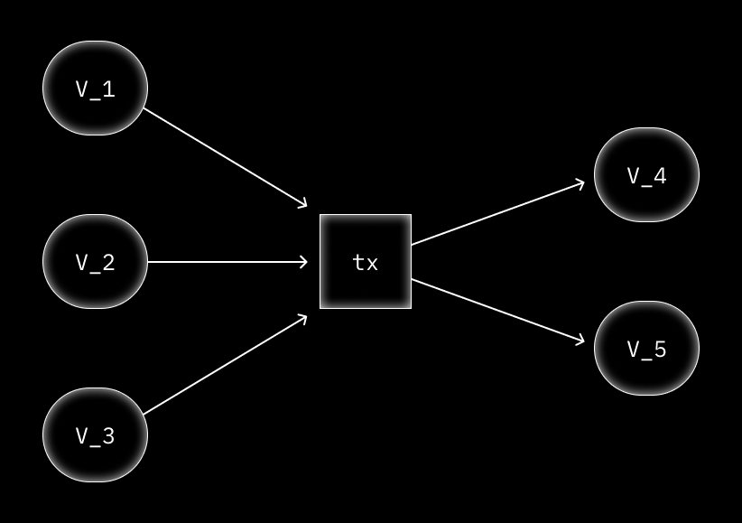
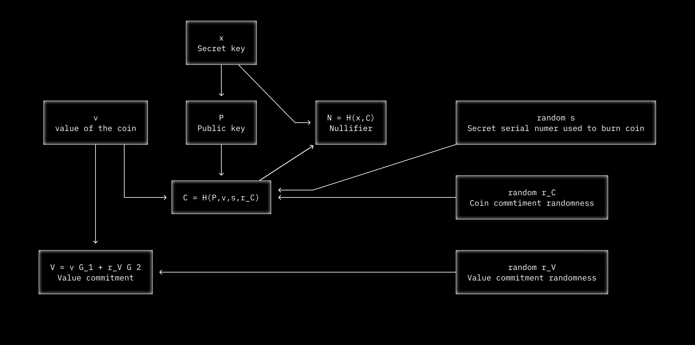

# Anonymous assets

DarkFi network allows for the issuance and transfer of anonymous assets
with an arbitrary number of parameters. These tokens are anonymous,
relying on zero-knowledge proofs to ensure validity without revealing
any other information. **All transactions over the network are managed
by smart contracts.**

New tokens are created and destroyed every time you send an anonymous
transaction. To send a transaction on DarkFi, you must first issue a
credential that commits to some value you have in your wallet. This is
called the **Mint** phase. Once the credential is spent, it destroys
itself: what is called the **Burn.**

Through this process, the link between inputs and outputs is broken.

## Mint

During the **Mint** phase we create a new coin commitment $C$, which is
bound to the public key $P$. The coin commitment $C$ is publicly
revealed on the blockchain and added to the Merkle tree, which is
stored locally on the DarkFi wallet.

We do this using the following process:

Let $v$ be the coin's value. Generate random $r_C$, $r_V$ and a secret
serial $\rho$. The random values ensure the uniqueness and security of
the commitment; the serial $\rho$ will be later used to generate the
nullifier $N$ of the burn phase and to tie $N$ to $C$.

Create a commitment to these parameters in zero-knowledge:

$$ C = H(P, v, \rho, r_C) $$

Check that the value commitment is constructed correctly:

$$ v > 0 $$
$$ V = v G_1 + r_V G_2 $$

Reveal $C$ and $V$ commitments. Add $C$ to the Merkle tree.

## Burn

When we spend the coin, we must ensure that the value of the coin
cannot be double spent. We call this the *Burn* phase. The process
relies on a $N$ nullifier, which we create  using the secret key $x$
for the public key $P$ and the coin itself $C$. Nullifiers are unique
per coin and prevent double spending. $R$ is the Merkle root. $v$ is
the coin's value.

Generate a random number $r_V$.

Check that the secret key corresponds to a public key:

$$ P = xG $$

Check that the public key corresponds to a coin which is in the merkle
tree $R$:

$$ C = H(P, v, \rho, r_C) $$
$$ C \in R $$

Derive the nullifier:

$$ N = H(x, C) $$

Check that the value commitment is constructed correctly:

$$ v > 0 $$
$$ V = v G_1 + r_V G_2 $$

Reveal $N$, $V$ and $R$. Check $R$ is a valid Merkle root. Check $N$
does not exist in the nullifier set.

The zero-knowledge proof confirms that $N$ binds to an unrevealed value
$C$, and that this coin is in the Merkle tree, without linking $N$
to $C$. Once the nullifier is produced the coin becomes unspendable.

## Adding values

Assets on DarkFi can have any number of values or attributes. This
is achieved by creating a credential $C$ and hashing any number of
values and checking that they are valid in zero-knowledge.

We check that the sum of the inputs equals the sum of the outputs. This
means that:

$$ B = \sum{V_{in}} - \sum{V_{out}} $$

And that $B$ is a valid point on the curve $G_2$.

This proves that $B = 0 G_1 + b G_2 = b G_2$ where $b$ is a secret
blinding factor for the amounts.

# Diagram

*Note: In the diagram $s$ correspond to the $\rho$*
