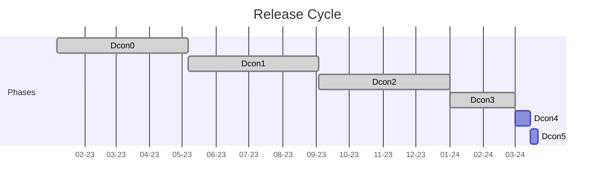

Architecture design
===================

This section of the book shows the software architecture of DarkFi and
the network implementations.

For this phase of development we organize into teams lead by a single
surgeon. The role of the team is to give full support to the surgeon
and make his work effortless and smooth.

| Component   | Description                                             | Status |
|-------------|---------------------------------------------------------|--------|
| consensus   | Algorithm for blockchain consensus                      | Alpha  |
| zk / crypto | ZK compiler and crypto algos                            | Alpha  |
| wasm        | WASM smart contract system                              | Alpha  |
| net         | p2p network protocol code                               | Alpha  |
| blockchain  | consensus + net + db                                    | Alpha  |
| bridge      | Develop robust & secure multi-chain bridge architecture | None   |
| tokenomics  | Research and define DRK tokenomics                      | Alpha  |
| util        | Various utilities and tooling                           | Alpha  |
| arch        | Architecture, project management and integration        | Alpha  |

## Release Cycle

<table>
    <tr>
        <th>Phase</th>
        <th>Description</th>
        <th>Duration</th>
        <th>Details</th>
        <th>Version</th>
    </tr>
    <tr>
        <td>Dcon0</td>
        <td>Research</td>
        <td></td>
        <td>
Research new techniques, draft up architecture design documents and
modify the specs.

During this phase the team looks into new experimental techniques and
begins to envision how the product will evolve during the next phase of
the cycle.
        </td>
        <td>pre-alpha</td>
    </tr>
    <tr>
        <td>Dcon1</td>
        <td>New features and changes</td>
        <td></td>
        <td>
Add big features and merge branches. Risky changes that are likely to
cause bugs or additional work must be done before the end of this phase.

The first 10 weeks overlap with the Dcon3  & Dcon4 phases of the
previous release, and many developers will focus on bug fixing in those
first weeks.

Developers dedicate a steady 1-2 days/week to the bug tracker, focusing
on triaging and newly introduced bugs.
        </td>
        <td>alpha</td>
    </tr>
    <tr>
        <td>Dcon2</td>
        <td>Improve and stabilize</td>
        <td></td>
        <td>
Work to improve, optimize and fix bugs in new and existing features. 
Only smaller and less risky changes, including small features, should
be made in this phase.

If a new feature is too unstable or incomplete, it will be reverted
before the end of this phase. Developers spend 2-3 days/week in the
bug tracker, triaging, fixing recently introduced or prioritized module
bugs.
        </td>
        <td>alpha</td>
    </tr>
    <tr>
        <td>Dcon3</td>
        <td>Bug fixing only</td>
        <td>2 months</td>
        <td>
Focus on bug fixing and getting the release ready.

Development moves to the stable stabilizing branch. In master Dcon1
for the next release starts. stable is regularly merged into master.

High priority bugs dictate how much time developers will spend in the 
tracker as oppose to work on the next release Dcon1 features.
        </td>
        <td>beta</td>
    </tr>
    <tr>
        <td>Dcon4</td>
        <td>Prepare release</td>
        <td>2 weeks</td>
        <td>
Stable branch is frozen to prepare for the release. Only critical and
carefully reviewed bug fixes allowed.

Release candidate and release builds are made.
Developers spend a short time 5 days/week with an eye in the tracker
for any unexpected high priority regression.
        </td>
        <td>release candidate</td>
    </tr>
    <tr>
        <td>Dcon5</td>
        <td>Release</td>
        <td>1 week</td>
        <td>
Stage where the final builds are packaged for all platforms, last
tweaks to the logs, memes, social media, video announcements.

The final switch is flicked on [dark.fi](https://dark.fi/) for the new
release to show up on the Download page.
        </td>
        <td>release</td>
    </tr>
</table>

## Mainnet Roadmap

High-level explanations and tasks on the mainnet roadmap, in no
particular order. Some may depend on others, use intuition.

### DAO Smart Contract

The DAO needs to have a parameter that defines the length of a
proposal and the time when it is allowed to vote. Could be a start
and end time or just end time. After end time has passed, new votes
should be rejected, and only `DAO::Exec` would be allowed.

The DAO also has to implement ElGamal-ish note encryption in order to
be able to be verified inside ZK. `darkfi-sdk` already provides an
interface to this, although not providing an interface to the zkVM,
just external. (See `ElGamalEncryptedNote` in `darkfi-sdk`). The
cryptography also has to be verified for correctness, as this was
just a proof of concept.

### Smart Contract

Client API:

The native contracts should have a unified and "standard" API so
they're all the same. Perhaps it is also possible to define some
way for contracts to expose an ABI so it becomes simpler and easier
for clients to get the knowledge they need to build transactions and
chain contract calls with each other.

Testing Environment:

There is a tool called Zkrunner that takes the zkas circuit and the
private inputs, then generates a proof and verify it. 

It's like an interactive environment for zkas circuit developer.
Without Zkrunner, the developer needs to manually program, and feed
the private and pulibc inputs and drive the verification.
It needs some code cleanup and documentation on how to use it.

### Passive APR/APY

Consensus participants should be incentivised to stake by getting
rewards for participation. We need to find something useful for them
to do in order to receive these rewards, and also we have to find a
way to ensure liveness throughout the entire epoch. The solution to
this should not be something that congests the consensus/transaction
bandwidth or increases the blockchain size a lot.

### Non-native Smart Contract Deployment

There is a basic smart contract called `deployooor` that is used as
a mechanism to deploy arbitrary smart contracts on the network. We
need to evaluate the best way to support this. The WASM needs to be
verified for correctness (e.g. look through the binary and find if
all symbols are in place) so that at least here we disallow people
from writing arbitrary data to the chain.

### Transaction Fees

TBD

### `drk`

UX!

We need to handle confirmed and unconfirmed transactions, make things
prettier and better to use. When broadcasting transactions, if they
pass locally, the wallet should be updated to represent the state
change but things should stay unconfirmed. The DAO SQL schema gives a
nice way to do this, where there's a `tx_hash`, etc. which
can be used to evaluate whether the transaction/coins/whatever was
confirmed.

We also discussed about having clients handle their own wallets,
and not providing a sink through `darkfid` where there's a single API
for interfacing with the wallet, and having to be closely integrated
over JSON-RPC <-> SQLite glue. `darkfid` will only ever have to manage
secrets for the consensus coins that are being staked and won't have
to deal with the entire wallet itself.

### `darkirc`

Write documentation about usage. We need proper tutorials about
running on mobile. Both weechat-android setups, and local ones.

A simple Android app can be made drawing inspiration from Orbot
where there is a big On/Off button that can start/stop the node on
the phone and then the user can use any IRC client they prefer.

### `tau`

TBD

### p2p (anon) git

The motivation is to move off of centralised platforms like Github. 
Additionally, it would ideally have the capability keep contributor
information private.

### P2P

The P2P library needs a complete test suite in order to more easily
be able to make changes to it without introducing regressions. This
includes bad network simulations, latency, etc. The P2P stack also
needs to be able to heal itself without restarting the application,
much in the way like when you unplug an ethernet cable and then
plug it back in.  Currently when this happens, all the P2P hosts
might be dropped from the known hosts db as they're considered
offline/unreachable, so we might want to implement some kind of
"quarantine" zone instead of deleting the peers whenever we are unable
to connect to them.

In the TLS layer of P2P communication, the client-server certificate
logic needs to be reviewed for security and we should define a protocol
for this.

### zkVM

The zkVM has to implement dynamic self-optimising circuits. The first
part and the scaffolding for this is already in place, now we need
to come up with an optimisation algorithm that is able to optimally
configure the columns used in the circuit based on what the circuit
is doing.

All the zkVM opcodes need to be benchmarked for their performance
and we need to see how many columns and rows they use so we're able
to properly price them for verification fees.

### Documentation

* Create beginner level tutorial to introduce contract development and
  tools.
* Create a list of outstanding work before mainnet.
