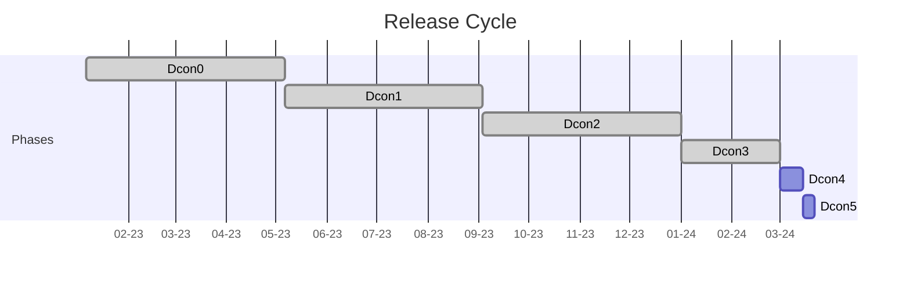

Architecture design
===================

This section of the book shows the software architecture of DarkFi and
the network implementations.

For this phase of development we organize into teams lead by a single
surgeon. The role of the team is to give full support to the surgeon
and make his work effortless and smooth.

| Component   | Description                                             | Status |
|-------------|---------------------------------------------------------|--------|
| consensus   | Algorithm for blockchain consensus                      | Alpha  |
| zk / crypto | ZK compiler and crypto algos                            | Alpha  |
| wasm        | WASM smart contract system                              | Alpha  |
| net         | p2p network protocol code                               | Alpha  |
| blockchain  | consensus + net + db                                    | Alpha  |
| bridge      | Develop robust & secure multi-chain bridge architecture | None   |
| tokenomics  | Research and define DRK tokenomics                      | Alpha  |
| util        | Various utilities and tooling                           | Alpha  |
| arch        | Architecture, project management and integration        | Alpha  |

## Release Cycle

```mermaid
gantt
    title Release Cycle
    dateFormat  DD-MM-YYYY
    axisFormat  %m-%y
    section Phases
    Dcon0            :done, d0, 06-01-2023, 120d
    Dcon1            :done, d1, after d0,   120d
    Dcon2            :done, d2, after d1,   120d
    Dcon3            :done, d3, after d2,   60d
    Dcon4            :      d4, after d3,   14d
    Dcon5            :      d5, after d4,   7d
```

| Phase | Description | Duration | Details | Version |
| --- | --- | --- | --- | --- |
| Dcon0 | Research | — | Research new techniques, draft architecture documents, and modify the specs. The team investigates experimental techniques and plans how the product will evolve during the next phase. | pre-alpha |
| Dcon1 | New features and changes | — | Add major features and merge branches. Risky changes must land before this phase ends. The first ten weeks overlap with Dcon3 and Dcon4 of the previous release, so developers also triage and fix newly introduced bugs. | alpha |
| Dcon2 | Improve and stabilize | — | Improve, optimize, and fix new and existing features. Only smaller, lower-risk changes should land. Unstable or incomplete features are reverted before the phase ends, while developers prioritize module bugs. | alpha |
| Dcon3 | Bug fixing only | 2 months | Focus on making the release ready. Development moves to the stable branch while Dcon1 for the next release starts on master. Stable is regularly merged into master, and high-priority bugs take precedence over new features. | beta |
| Dcon4 | Prepare release | 2 weeks | Freeze the stable branch except for carefully reviewed critical fixes. Produce release-candidate and release builds and watch for high-priority regressions. | release candidate |
| Dcon5 | Release | 1 week | Package final builds for all platforms, finish release communications, and publish the new release on [dark.fi](https://dark.fi/). | release |

## Mainnet Roadmap

High-level explanations and tasks on the mainnet roadmap, in no
particular order. Some may depend on others, use intuition.

### DAO Smart Contract

The DAO needs to have a parameter that defines the length of a
proposal and the time when it is allowed to vote. Could be a start
and end time or just end time. After end time has passed, new votes
should be rejected, and only `DAO::Exec` would be allowed.

The DAO also has to implement ElGamal-ish note encryption in order to
be able to be verified inside ZK. `darkfi-sdk` already provides an
interface to this, although not providing an interface to the zkVM,
just external. (See `ElGamalEncryptedNote` in `darkfi-sdk`). The
cryptography also has to be verified for correctness, as this was
just a proof of concept.

### Smart Contract

Client API:

The native contracts should have a unified and "standard" API so
they're all the same. Perhaps it is also possible to define some
way for contracts to expose an ABI so it becomes simpler and easier
for clients to get the knowledge they need to build transactions and
chain contract calls with each other.

Testing Environment:

There is a tool called Zkrunner that takes the zkas circuit and the
private inputs, then generates a proof and verify it. 

It's like an interactive environment for zkas circuit developer.
Without Zkrunner, the developer needs to manually program, and feed
the private and pulibc inputs and drive the verification.
It needs some code cleanup and documentation on how to use it.

### Passive APR/APY

Consensus participants should be incentivised to stake by getting
rewards for participation. We need to find something useful for them
to do in order to receive these rewards, and also we have to find a
way to ensure liveness throughout the entire epoch. The solution to
this should not be something that congests the consensus/transaction
bandwidth or increases the blockchain size a lot.

### Non-native Smart Contract Deployment

There is a basic smart contract called `deployooor` that is used as
a mechanism to deploy arbitrary smart contracts on the network. We
need to evaluate the best way to support this. The WASM needs to be
verified for correctness (e.g. look through the binary and find if
all symbols are in place) so that at least here we disallow people
from writing arbitrary data to the chain.

### Transaction Fees

TBD

### `drk`

UX!

We need to handle confirmed and unconfirmed transactions, make things
prettier and better to use. When broadcasting transactions, if they
pass locally, the wallet should be updated to represent the state
change but things should stay unconfirmed. The DAO SQL schema gives a
nice way to do this, where there's a `tx_hash`, etc. which
can be used to evaluate whether the transaction/coins/whatever was
confirmed.

We also discussed about having clients handle their own wallets,
and not providing a sink through `darkfid` where there's a single API
for interfacing with the wallet, and having to be closely integrated
over JSON-RPC <-> SQLite glue. `darkfid` will only ever have to manage
secrets for the consensus coins that are being staked and won't have
to deal with the entire wallet itself.

### `darkirc`

DarkIRC is a P2P chat daemon backed by Event Graph synchronization. It exposes a
local IRC interface, rotates message DAGs hourly, and supports bounded normal
nodes and unpruned archive nodes. See the [DarkIRC user guide](../misc/darkirc/darkirc.md)
and [protocol reference](../misc/darkirc/specification.md).

### `tau`

TBD

### p2p (anon) git

The motivation is to move off of centralised platforms like Github. 
Additionally, it would ideally have the capability keep contributor
information private.

### P2P

The P2P library needs a complete test suite in order to more easily
be able to make changes to it without introducing regressions. This
includes bad network simulations, latency, etc. The P2P stack also
needs to be able to heal itself without restarting the application,
much in the way like when you unplug an ethernet cable and then
plug it back in.  Currently when this happens, all the P2P hosts
might be dropped from the known hosts db as they're considered
offline/unreachable, so we might want to implement some kind of
"quarantine" zone instead of deleting the peers whenever we are unable
to connect to them.

In the TLS layer of P2P communication, the client-server certificate
logic needs to be reviewed for security and we should define a protocol
for this.

### zkVM

The zkVM has to implement dynamic self-optimising circuits. The first
part and the scaffolding for this is already in place, now we need
to come up with an optimisation algorithm that is able to optimally
configure the columns used in the circuit based on what the circuit
is doing.

All the zkVM opcodes need to be benchmarked for their performance
and we need to see how many columns and rows they use so we're able
to properly price them for verification fees.

### Documentation

* Create beginner level tutorial to introduce contract development and
  tools.
* Create a list of outstanding work before mainnet.
