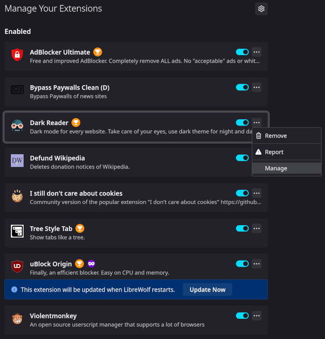
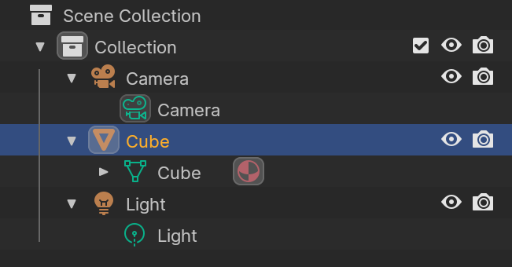

# Wallet Notes

## Optimizing Note Decryption

See [DAGSync: Graph-aware Zcash wallets](https://words.str4d.xyz/dagsync-graph-aware-zcash-wallets/) by str4d.

TLDR: as we're syncing the wallet, we normally scan forwards
prioritizing both sends and receives the same. Instead we can optimize
this for immediate spendability (despite not having full received
balance). Assume we have the entire blockchain state but haven't yet
trial decrypted all notes.

* **Nullifier Tracking:** for every note, look for a nullifier. If it
  doesn't exist then the note has not yet been spent.
* **Targeted Decryption:** when the nullifier exists, then check the
  output notes of that transaction. One of these is likely to be change
   we can spend.

Additionally:

* **Source Discovery:** go backwards from the latest block and trial
  decrypt outputs. Then for those decrypted outputs, check their
  nullifiers (as per nullifier tracking above).
* **History Discovery:** simultaneously another scan goes forwards from
  the last sync point until it meets the source discovery (going
  backwards).

**Knitting** is where periodically wallets will gather all unspent
coins and construct a new one. It will use the memo field to indicate
to wallet sync that it doesn't need to go back any further than this
point.

However since wallets keep track of their own coins (assuming a wallet
isn't shared between 2 devices) which is the majority usecase, then
this technique is less relevant since you know which coins you've spent.

## Modules and Addons

The current standard model for smart contract cryptocurrencies is to
abuse the web browser's plugin architecture. This has several
undesirable effects:

* Dependency on js.
* Poor security model.
* Centralized frontends. The frontend can be loaded via IPFS (usually
  via a gateway), but it still needs to access a hosted RPC. Users can
  deploy their own and then configure the RPC URL but this is
  complicated so it rarely happens. Then there are projects for
  "decentralized RPC" but this is lipstick on a cow (the bloated browser).
  * Hosted frontends are a legal risk. See TornadoCash.
* Limitations of the browser addon architecture. I cannot for example
  run a p2p network and must go through some centralized "solution"
  (not a solution but actually an anti-pattern).
  * Firefox used to have a much stronger XUL framework which enabled
    cool things like remote CLI control of the browser or interfacing
    with other tools, but they deleted this and just put Chrome's addon
    architecture which made a whole load of addons no longer possible.
* Non-portable. Running metamask ethereum apps on mobile is generally
  non-trivial. Wallets should easily work across all platforms and
  devices seamlessly.
  * Metamask has a separate standalone Android app which is non-ideal
    since now the big app has 2 separate impls. Ideally there is just
    one big app since diverging impls lead to fragmentation.
* The architecture is specific to browsers and non-portable to other
  software unless they include a browser engine like WebKit which is a
  huge chunk of code.

Benefits of [hackable software](https://www.geoffreylitt.com/2019/07/29/browser-extensions) are:

* Small tools, not big apps. The software is just a minimal shell. All
  functionality exists as plugins.
* User extendable, which allows community control over the direction and
  use of the software.
  * Niche users can find a plugin for their edgecase which might not be
    supported in the big app.
* Easy entry for devs that have an idea compared to making a new app or
  tool.
  * Blender has a built in Python terminal, and the code is fully
    introspectable which allows exploring the codebase and calling
    `help(foo)` on objects.
* Most major successful products are hackable. Important examples:
  Winamp, Blender3D, Firefox.

### Addons

Addons are sandboxed WASM code which has tightly controlled permissions.
They are untrusted third party 'apps'.

Most functionality are the client code for wallets. For example we want
to use the DAO contract so we download an addon. An addon may provide
this functionality:

* An API that can be called by other addons.
* A UI schema for building an interface.
* Transaction scanner that can do things like trial decryption of notes,
  maintaining any client specific state.

Addons should be sandboxed. By default access to all host functions is
blacklisted, and they must be explicitly whitelisted to call any
function other addons.

We can run addons in separate threads so that if one of them crashes,
the host application can simply kill the process. Addons can then run
alongside each other without any effect on each other. However this
leads to increased memory usage from the overhead of having every addon
spawning a new thread, so we may wish to use WASM functionality to
interpret addon functions that take too long.

There is a special function inside the WASM which is called on startup
called `requested_permissions()`. This is used to request the
permissions from the user who then adds it to the whitelist for this
addon. While the requested permissions will be a list of namespaced
functions, the UI will simply display these as something simple to the
user like "manage a database" or "use event graph" (see below).

Addons are loaded dynamically and can be downloaded from a source such
as the DHT network.




Blender's addon browser looks much better than Firefox's.

When creating addon UIs, there should be a way to allow live reloading
of the UI for convenient design, and possibly the impl too which makes
live debugging possible.

#### Addon Maintenance

Overtime there will be a tension between upgrading the core API and
maintaining a large ecosystem of addons. Therefore there should be a
centralized git repo for all addons listed in the wallet. Addon authors
can tag releases and request their addon be updated downstream by the
wallet maintainers.

This way when large breaking API changes are needed, we have the
ability to:

* Simultaneously update all addons at once.
* Communicate with addon authors to coordinate any changes needed such
  as architectural ones.
* Ensure a canonical repository of vetted addons.

This is similar to how Linux distributions maintain packages.

Addons must also have contact details so darkfi core and the wallet
team are able to contact them.

### Modules

These are dynamic objects which are trusted and provide full access to
the host system.

An example of such a module could be an `event_graph` module.
This enables addons to request a specific event graph instance. For
example the users of a DAO may wish to coordinate through the p2p
network. They would therefore use the `event_graph` module to create an
event graph instance for that usecase, and the p2p network would create
a swarm for this event graph. All of this would be handled by the
module which simply provides a convenient interface to the addon.

This enables using the full power of the system, but safely segregating
this functionality from untrusted addons through a firewall.
It solves the issue of relying on hosted/centralized gateways since
user wallets will just spin up p2p nodes locally.

Modules can only be installed manually from file and require
restarting the wallet.

### Scenegraph

This is a popular gamedev design pattern where the entire program state
is represented as an introspectable tree. It's similar to the UNIX
pattern of "everything is a file", and maybe plan9's idea.

[The scenegraph](https://archive.gamedev.net/archive/reference/programming/features/scenegraph/index.html)
is a world where the children are objects, and the objects have
attributes that can be read and operated on. These can all be composed
together through generic node interfaces.


*example of a scenegraph from a game engine*



*scenegraph in blender*

```
Application
    SettingsRegistry
    Window #1
        TabBar
            Tab #1
                Panel #1
                    WasmSandbox
                        ...
                Panel #2
                ...
            Tab #2
                ...
            ...
    Window #2
        ...
    Module #1
```

* Each object can emit events, and subscribe to events from other
  objects. All objects have an `event()` method and `update()` method.
  Update is called per frame, while event can be used for timer events
  such as periodic updates or wakeups, as well as input events.
* Drawing related objects have a boundary where they can draw.
  They all implement a `draw()` method. Drawing outside the boundary is
  disallowed.
* Everything has names, attributes and methods with docstrings.
  This is all introspectable and eventually scriptable.
  Also the internal state can be accessed through inbuilt terminal,
  possibly using Python.

## UI Specifics

Laundry list of required features:

* XUL/bpy inspired. There is a small wallet core, but the entire UI is
  created using definitions and the DSL.
* Dynamic fractional scaling.
* Customizable scriptable interface, preferably using Python and/or Rust.
* Calm UI with default darkmode. No animations.
* Text oriented, clean and minimal design.
* Avoid modal dialogs. Instead use mode toggling and expanding panels.
  * The UI should enable you to view all relevant options and tools at a
    glance, without the need for pushing or dragging windows around.
  * Tools and interface options designed to not block the user from
    using any other parts.
    * The UI should stay responsive by all means.
        * This means the UI runs in its own thread, communicating with
          the backend which runs on another thread.
        * Non blocking and async. Remains responsive despite work
          happening.
  * User input should remain as consistent and predictable as possible.
* Installation free: run out of the box for new installs, not requiring
  root system access.
* Responsive design across desktop and mobile devices with minimal
  specific code or changes required. Ideally none at all.
* First class CLI support with access to all functionality existing in
  the UI.
  * Possibly there is a way of transforming the UI schema specced by addons
    into a command line interface.

See also the [Blender Human Interface Guidelines: Paradigms](https://developer.blender.org/docs/features/interface/human_interface_guidelines/paradigms/).

## Roadmap

1. Simple `drk` CLI tool with basic core apps working. We want to ship
   so this is the only core prerequisite to start.
2. We can add WASM addons with the basic framework after. Then migrate
   core apps such as money or DAO to this.
3. Add modules subsystem.
4. Construct the UI.
  1. Create the overall framework of resizable 'editors' and define the
     terminology.
  2. Add in the scripting functionality for the UI.
  3. Ensure cross-platform support and clean architecture.
  4. Iterate on finer UI design specifics.
  5. Allow customization of UI such as colors and style (optional).

Steps 3 and 4 can be done in parallel.

## Target Mainnet Functionality

Multi-platform main view with splitting and these editors:

* Money::transfer()
* Money::swap()
* DAO
* Chat
* Explorer
* Settings

## Specifics

### Story

The story goes like this. There's a node running of some kind. This
could be darkfid or darkirc.

In the case of darkfid, there's additional per wallet processing that's
done such as scanning transactions. Currently this is the role played
by drk scan.

Regardless of whether there's one node with functionality existing as
pluggable modules, we assume now there are nodes running which the
wallet/UI must communicate with.

Inside the user wallet, there are multiple plugins. A plugin might need
to query the blockchain, spawn a p2p network (to exchange data for OTC
or coordinate DAO activity as examples). They do this by connecting to
the nodes.

### Key Concepts

We now give an overview of the current iteration of the scene graph:

* Nodes have a type. Each node can have multiple children.
* It is a graph not a tree. A node can have multiple parents.
* Each node has several properties which have types such as f32, u32,
  str, enum. Properties can also be an array or vec of these types.
  See `bin/darkwallet/pydrk/api.py:5` for the fields in a property.
* Nodes have signals such as `mouse_clicked`. Multiple slots can be
  registered for a signal. Think of this like notifications.
* Nodes have methods such as `create_foo()` which is like request-reply.

### Plugins

Each app has a separate plugin. Plugins have their own private internal
data. Any data they wish to expose can be done by providing properties
or methods in their node in the scene graph.

The scene graph then applies access restrictions depending on the
ownership semantics of properties and methods (think like UNIX users
and groups).

Plugins provide `init()` and `update(event)` functions. `init()` is
called when a new *plugin instance* is created. Plugins can have
multiple instances.

Using the scene graph, this is scriptable from any language,
introspectable and with permissions - using a data structure inspised
by UNIX and plan9.

#### Example

When a plugin is opened, the UI creates

```
    /plugin/dao/instance1
```
and gives it a layer to draw in, which is simultaneously linked into both
```
    /window/dao_instance1_layer
    /plugin/dao/instance1/dao_instance1_layer
```

The plugin can then speak with modules by calling methods or
subscribing to signals on `/mod/darkfid`. Methods and signals are
automatically proxied from the node.

### Running a New Node per Function

Lets say we wish to do OTC swaps and utilize the event graph. Are users
then required to run a new node per app?

At least in this case, there should be a way to spin up an event graph.

For scanning transactions, is this done at startup incurring an
initialization cost when opening the wallet? I guess so to maintain
independence of keys from the darkfid node.

Another example is the task manager and darkirc chat. Do these remain
separate daemons? When we add swarming support to p2p, it might be
possible to merge all p2p functionality across apps into a unified
subsystem, reducing complexity. In which case there should be a simple
way to utilize this subsystem.

The more nodes users are required to run, the more difficult it will
become to  have a decentralized network, so we should find a way to
reduce the burden for users to setup our infra.

### Usage Patterns

Wallets are clients talking to the node (remote).

* There's persistent nodes running some process to sync data from the
  network (darkfid downloading/verifying blockchain, event graph, ...)
* There's scanning done by wallets on startup (check for recv'd
  payments, decrypt DMs, .etc)
  * Scanning downloads the updates from persistent nodes
* Wallets can interact with nodes to push data to the network, or
  communicate with other nodes .etc
* Wallet apps can talk with each other.

## References

* [Veil: Private Browsing Semantics Without Browser-side Assistance](https://mickens.seas.harvard.edu/files/mickens/files/veil.pdf)
* [Atlantis: Robust, Extensible Execution Environments for Web Applications](https://scholar.harvard.edu/files/mickens/files/atlantis.pdf)
