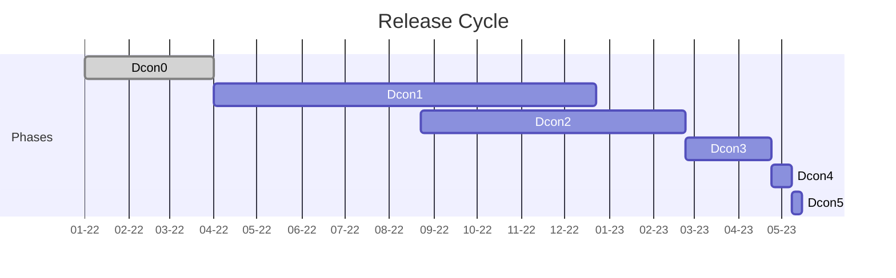

Architecture design
===================

This section of the book shows the software architecture of DarkFi and
the network implementations.

For this phase of development we organize into teams lead by a single
surgeon. The role of the team is to give full support to the surgeon
and make his work effortless and smooth.

| Component   | Description                                                            | Surgeon | Copilot | Assistant | Status   |
|-------------|------------------------------------------------------------------------|---------|---------|-----------|----------|
| consensus   | Algorithm for blockchain consensus                                     | err     | agg     | das       | Progress |
| zk / crypto | ZK compiler and crypto algos                                           | par     | nar     |           | Mature   |
| wasm        | WASM smart contract system                                             | par     | nar     | xsan      | Alpha    |
| net         | p2p network protocol code                                              | agg     | xsan    | nar       | Mature   |
| blockchain  | consensus + net + db                                                   | err     | das     |           | Easy     |
| bridge      | Develop robust & secure multi-chain bridge architecture                | par     | xsan    |           | None     |
| tokenomics  | Research and define DRK tokenomics                                     | xeno    | err     | nar       | Alpha    |
| util        | Various utilities and tooling                                          | nar     | xsan    | das       | Mature   |
| arch        | Architecture, project management and integration                       | nar     | par     |           | Alpha    |

## Release Cycle

<table>
    <tr>
        <th>Phase</th>
        <th>Description</th>
        <th>Duration</th>
        <th>Details</th>
        <th>Version</th>
    </tr>
    <tr>
        <td>Dcon0</td>
        <td>Research</td>
        <td></td>
        <td>
Research new techniques, draft up architecture design documents and modify the specs.

During this phase the team looks into new experimental techniques and begins to envision
how the product will evolve during the next phase of the cycle.
        </td>
        <td>pre-alpha</td>
    </tr>
    <tr>
        <td>Dcon1</td>
        <td>New features and changes</td>
        <td></td>
        <td>
Add big features and merge branches. Risky changes that are likely to
cause bugs or additional work must be done before the end of this phase.

The first 10 weeks overlap with the Dcon3  & Dcon4 phases of the previous
release, and many developers will focus on bug fixing in those first weeks.

Developers dedicate a steady 1-2 days/week to the bug tracker, focusing on
triaging and newly introduced bugs.
        </td>
        <td>alpha</td>
    </tr>
    <tr>
        <td>Dcon2</td>
        <td>Improve and stabilize</td>
        <td></td>
        <td>
Work to improve, optimize and fix bugs in new and existing features. 
Only smaller and less risky changes, including small features, should be
made in this phase.

If a new feature is too unstable or incomplete, it will be reverted before the end of this phase.
Developers spend 2-3 days/week in the bug tracker, triaging, fixing recently introduced or prioritized module bugs.
        </td>
        <td>alpha</td>
    </tr>
    <tr>
        <td>Dcon3</td>
        <td>Bug fixing only</td>
        <td>2 months</td>
        <td>
Focus on bug fixing and getting the release ready.

Development moves to the stable stabilizing branch. In 
master Dcon1 for the next release starts. 
stable is regularly merged into master.

High priority bugs dictate how much time developers will spend in the 
tracker as oppose to work on the next release Dcon1 features.
        </td>
        <td>beta</td>
    </tr>
    <tr>
        <td>Dcon4</td>
        <td>Prepare release</td>
        <td>2 weeks</td>
        <td>
Stable branch is frozen to prepare for the release. Only critical and carefully reviewed bug fixes allowed.

Release candidate and release builds are made.
Developers spend a short time 5 days/week with an eye in the tracker for any unexpected high priority regression.
        </td>
        <td>release candidate</td>
    </tr>
    <tr>
        <td>Dcon5</td>
        <td>Release</td>
        <td>1 week</td>
        <td>
Stage where the final builds are packaged for all platforms, last tweaks
 to the logs, memes, social media, video announcements.

The final switch is flicked on [dark.fi](https://dark.fi/) for the new
release to show up on the Download page.
        </td>
        <td>release</td>
    </tr>
</table>
