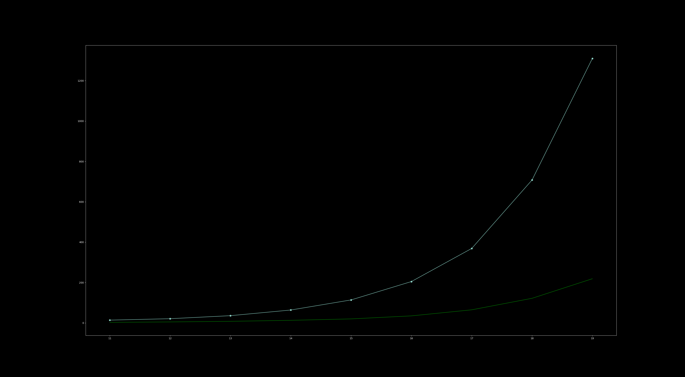

# ZK Circuits

Tested with `proof/arithmetic.zk`. Graph of verification times:



Proving times graph looks the same.

```
cargo test bench_zk --release --all-features -- --nocapture
```

You may need to compile `proof/arithmetic.zk`. Run `make zkas`, then do
`zkas proof/arithmetic.zk`.

## Desktop

```
Benchmarking k=11
Avg proving time: 375 ms
Avg verification time: 3 ms
Benchmarking k=12
Avg proving time: 588 ms
Avg verification time: 5 ms
Benchmarking k=13
Avg proving time: 965 ms
Avg verification time: 8 ms
Benchmarking k=14
Avg proving time: 1688 ms
Avg verification time: 13 ms
Benchmarking k=15
test bench_zk has been running for over 60 seconds
Avg proving time: 3038 ms
Avg verification time: 20 ms
Benchmarking k=16
Avg proving time: 6043 ms
Avg verification time: 35 ms
Benchmarking k=17
Avg proving time: 13297 ms
Avg verification time: 65 ms
Benchmarking k=18
Avg proving time: 26366 ms
Avg verification time: 122 ms
Benchmarking k=19
Avg proving time: 65233 ms
Avg verification time: 219 ms
```

## Laptop

```
Benchmarking k=11
Avg proving time: 862 ms
Avg verification time: 14 ms
Benchmarking k=12
Avg proving time: 1561 ms
Avg verification time: 21 ms
Benchmarking k=13
test bench_zk has been running for over 60 seconds
Avg proving time: 2908 ms
Avg verification time: 36 ms
Benchmarking k=14
Avg proving time: 5586 ms
Avg verification time: 64 ms
Benchmarking k=15
Avg proving time: 10855 ms
Avg verification time: 114 ms
Benchmarking k=16
Avg proving time: 22996 ms
Avg verification time: 205 ms
Benchmarking k=17
Avg proving time: 52829 ms
Avg verification time: 369 ms
Benchmarking k=18
Avg proving time: 116140 ms
Avg verification time: 708 ms
Benchmarking k=19
Avg proving time: 245032 ms
Avg verification time: 1310 ms
```

# WASM

Times are in micro-seconds. To replicate these tests simply uncomment the line
in `src/contract/dao/tests/integration.rs` which is `wallet.bench_wasm = true;`.
Then do the following lines:

```bash
cd src/contract/dao/
make test
```

Note if you get an error about wasm bincodes not existing, try cd'ing to all
directories in the parent, running `make` in them, then returning back to this
directory and repeating the steps again.

## Desktop

| call                | tx-hash                                                          |   call-idx |   meta() |   process() |   update() |
|---------------------|------------------------------------------------------------------|------------|----------|-------------|------------|
| dao::mint           | f5f170b8d6104cbfb9fb4cdd80ea3e47e8628403ff94915cc654d43e85769004 |          0 |      582 |          95 |       3162 |
| money::genesis_mint | 25d164d78d6581fed6a9509712a3ea20d13a60505e33ab1217d9ffd94d14f175 |          0 |      743 |        3592 |       3311 |
| money::token_mint   | 6e410bd320bad9754c06e9b0e4aa4627f04c6add0f17e45e7dfe2e68bc983779 |          0 |      304 |          36 |       3285 |
| money::token_mint   | 6e410bd320bad9754c06e9b0e4aa4627f04c6add0f17e45e7dfe2e68bc983779 |          1 |      895 |         226 |          9 |
| money::token_mint   | 96f3b679eda6ff33f48fd23029462593536719aad3cd3d1e940c04e02b264940 |          0 |      293 |          28 |       3250 |
| money::token_mint   | 96f3b679eda6ff33f48fd23029462593536719aad3cd3d1e940c04e02b264940 |          1 |      888 |         228 |          9 |
| money::token_mint   | 33887c0a08f384118178826240efc89b5464eb0aaf39005310a2798703f81c6f |          0 |      301 |          28 |       3389 |
| money::token_mint   | 33887c0a08f384118178826240efc89b5464eb0aaf39005310a2798703f81c6f |          1 |      920 |         232 |         10 |
| dao::propose        | 29c8bf860566977dcae00a13eafcf4442b3674462732783950d19e8474e055d5 |          0 |      881 |         767 |        172 |
| dao::vote           | 2957ec3b8d22541b0181ae75b9f486e7d0f21c16af52678aaaa27e1d3a515b9a |          0 |     1155 |        1126 |        316 |
| dao::vote           | 567b49f00c4e1e59dcb3e6e6fdd660324a81d013ea4fc52a2f6cd1cbe09b4ace |          0 |     1480 |        1184 |        344 |
| dao::vote           | 74b9e7669126328255bae8aed3be08530e835971f88fa70114803f05c7eab01e |          0 |     1134 |        1124 |        316 |
| dao::exec           | 304d95c75850c837059cb94b4dafbdf5bb06711f31e79ec2ffecc9cb3101193f |          0 |     2236 |        1143 |          9 |
| dao::exec           | 304d95c75850c837059cb94b4dafbdf5bb06711f31e79ec2ffecc9cb3101193f |          1 |     1440 |         480 |      11331 |
| dao::exec           | 304d95c75850c837059cb94b4dafbdf5bb06711f31e79ec2ffecc9cb3101193f |          2 |     1350 |         381 |         14 |

## Laptop

| call                | tx-hash                                                          |   call-idx |   meta() |   process() |   update() |
|---------------------|------------------------------------------------------------------|------------|----------|-------------|------------|
| dao::mint           | 3cabaf7b2c959e18ec504bf94a6b5251fb74bf38864b50e817229738290b703c |          0 |     1395 |         239 |       6509 |
| money::genesis_mint | 2b8060fac7ab25487c956292a82c16d7bd7684f5f8927d9364a64ecdbda3daa7 |          0 |     1893 |        9298 |       7981 |
| money::token_mint   | 66c0a9719254579144fe0d66d11d9f2a25b2fda1fd6e8e84b0b986ebfb69af76 |          0 |      711 |          56 |       6529 |
| money::token_mint   | 66c0a9719254579144fe0d66d11d9f2a25b2fda1fd6e8e84b0b986ebfb69af76 |          1 |     2558 |         636 |         22 |
| money::token_mint   | 03542927d0650c1dd5bb5d87af340e6adb3ce8e05934a3fd2d5333acf3e59e1d |          0 |      716 |          60 |       6238 |
| money::token_mint   | 03542927d0650c1dd5bb5d87af340e6adb3ce8e05934a3fd2d5333acf3e59e1d |          1 |     2754 |         821 |         18 |
| money::token_mint   | cec5ffa55a802d093be3827a2f5bef400352b777111b26a443432dd7c6683707 |          0 |      731 |          61 |       6765 |
| money::token_mint   | cec5ffa55a802d093be3827a2f5bef400352b777111b26a443432dd7c6683707 |          1 |     3587 |         653 |         14 |
| dao::propose        | 1502ffa4e6ab3ca452f73a4e76a919f8fe822319e7d75a713af3228c03834f7b |          0 |     2291 |        2064 |        470 |
| dao::vote           | ea62167a013d5e5c040b9f9c00b41f3d336c3d24060a2c641adaa98d5fdea83b |          0 |     2870 |        3030 |        841 |
| dao::vote           | 8a76ecfe209fd6283fa4543dba72d2988dc9587a761357224b1a835f0f936c3c |          0 |     3038 |        3164 |        854 |
| dao::vote           | 698478f1c5eb283233fb8688fff5ae5c77719ac0aa40b9a5850b64ab5e139fbf |          0 |     2974 |        3066 |        818 |
| dao::exec           | ad68c7059d529adb8d4dbc2a511dd2a4f473aa1d088c97258bb04f396801bc5c |          0 |     5944 |        3022 |         14 |
| dao::exec           | ad68c7059d529adb8d4dbc2a511dd2a4f473aa1d088c97258bb04f396801bc5c |          1 |     3843 |        1358 |      26049 |
| dao::exec           | ad68c7059d529adb8d4dbc2a511dd2a4f473aa1d088c97258bb04f396801bc5c |          2 |     2954 |        1100 |         44 |
