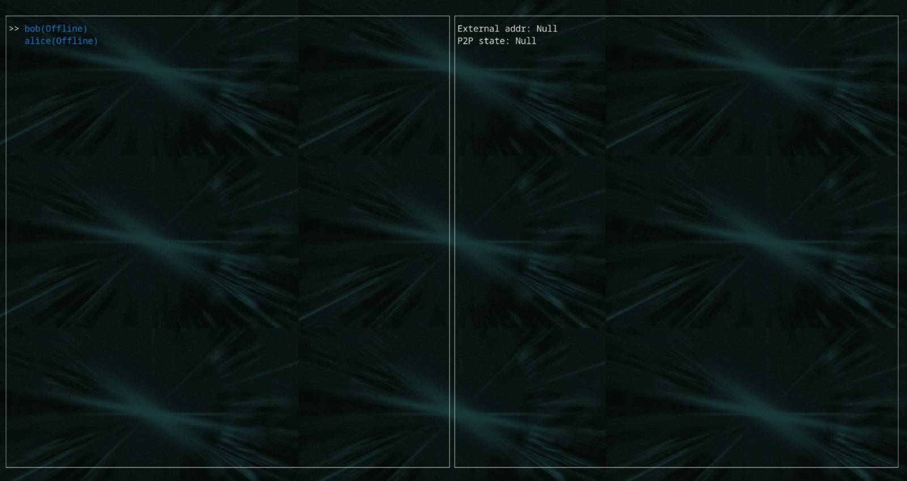

# Using dnetview

Finally, we're ready to use `dnetview`. Go to the `dnetview` directory
and spawn a new config file by running it once:

```bash
cd darkfi
make BINS=dnetview
./dnetview
```

You should see the following output:

```
Config file created in '"/home/USER/.config/darkfi/dnetview_config.toml"'. Please review it and try again.
 ```

Edit the config file to include the JSON-RPC accept addresses for Alice
and Bob:

```toml
[[nodes]]
name = "alice"
rpc_url="tcp://127.0.0.1:55054"

[[nodes]]
name = "bob"
rpc_url="tcp://127.0.0.1:51054"
```

Now run `dnetview`:

```bash
./dnetview
```

This is what you should see:



We haven't ran Alice and Bob yet, so `dnetview` can't connect to them. So
let's run Alice and Bob.

```bash
cargo run a
```

```bash
cargo run b
```

Now try running `dnetview` again.


That's fun. Use `j` and `k` to navigate. See what happens when you select
a `Channel`.


On each `Channel`, we see a log of messages being sent across the network.
What happens when we send a message?


This is Bob receiving a DchatMsg message on the `Channel`
`tcp://127.0.0.1:51554`. Pretty cool.

