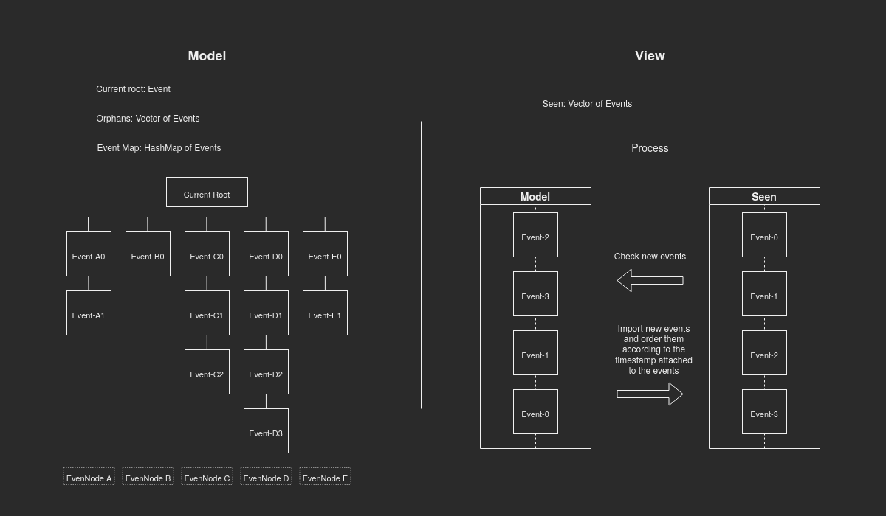
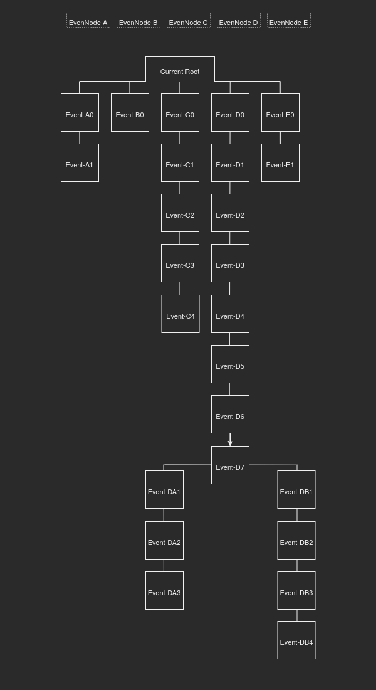

# Architecture 

Tau using Model–view software architecture. All the operations, main data structures, 
and handling messages from network protocol, happen in the `Model` side. 
While keeping the `View` independent of the `Model` and focusing on getting update 
from it continuously.

## Model

The `Model` consist of chains(`EventNodes`) structured as a tree, each chain has Event-based
list. To maintain strict order in chain, Each `Event` dependent on the hash of the previous `Event`. 
All the chains share a root `Event` to preserve the tree structure. 

### Add new Event

On receiving new `Event` from the network protocol, the `Event` add to the
orphans list, `Event` from orphans list add to chains according to its ancestor. 

For example, in the <em> Example1 </em> below, An `Event` add to the first chain if
its previous hash is Event-A1

### Remove old chains 

TODO

### Update the root 

TODO

## View

The `View` asking `Model` for new `Event`s, then dispatching these `Event`s to the clients. 

The `Event`s in `View` are sorted according to the timestamp attached to each `Event`.

Example1

Example2

