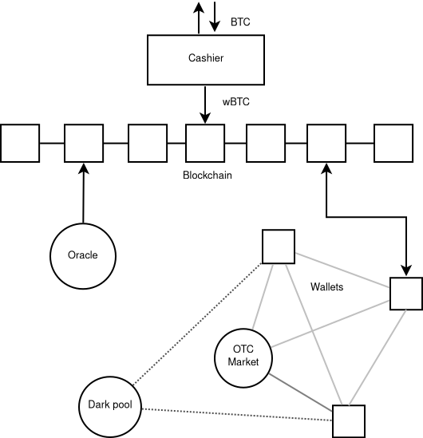

# Overview

DarkFi is a layer one proof-of-stake blockchain that supports anonymous applications. It is currently under heavy development. This overview will outline a few key terms that help explain DarkFi.

**Cashier:** The Cashier is the entry-point to the DarkFi network. Its role is to exchange cryptocurrency assets for anonymous wrapped tokens that are pegged to the underlying currency. This is fully redeemable at cash-out. For example, if you deposit 1 ETH, you will receive 1 wETH on entry to the DarkFi network. If you gain a further 0.5 ETH on a successful trade, you will exit with 1.5 ETH, minus network fees.

Much like on a traditional OTC trading website, anyone can be a cashier. Cashier's have one public key, however a Cashier can also be a multisig through an aggregated public key.

Currently, the role of the Cashier is trusted and centralized. As a next step, DarkFi plans to implement trust-minimized bridges and eventually fully trustless bridges.

**Blockchain:** Once new anonymous tokens (e.g. wETH) have been issued, the Cashier posts that data on the blockchain. This data is encrypted and the transaction link is broken.

On the DarkFi network, the role of the blockchain is minimized to data availability. All execution and computation is handled locally in a user's wallet. However, this does not impact security: if non-valid behavior is detected, it will be rejected from the blockchain.

The DarkFi blockchain uses a Proof-of-Stake consensus system. Validators are paid for in transaction fees, which are denominated in DRK. Anyone can be a validator and stake DRK in exchange for transaction fees.

**Wallets:** A wallet is a portal to the DarkFi network. It provides the user with the ability to open and enter into trades, as well as to issue their own custom contracts and assets. Each wallet is a full node and stores a copy of the blockchain. All contract execution is done locally on the DarkFi wallet.

The DarkFi wallet communicates with other wallets through a peer-to-peer network. This peer-to-peer network is called the **Pulse Network** and allows for the coordination of anonymous trades.

