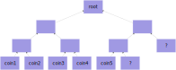

# Cryptographic Schemes

## `PoseidonHash` Function

Poseidon is a circuit friendly permutation hash function described in
the paper GKRRS2019.

| Parameter         | Setting                        |
|-------------------|--------------------------------|
| S-box             | $x → x⁵$                       |
| Full rounds       | 8                              |
| Partial rounds    | 56                             |

Our usage matches that of the halo2 library. Namely using a sponge configuration
with addition which defines the function
$$\textrm{PoseidonHash} : 𝔽ₚ × ⋯ × 𝔽ₚ → 𝔽ₚ$$

## Bulla Commitments

Given an abstract hash function such as [`PoseidonHash`](#poseidonhash-function),
we use a variant of the commit-and-reveal scheme to define anonymized
representations of objects on chain. Contracts then operate with these anonymous
representations which we call bullas.

Let $\textrm{Params} ∈ 𝔽ₚⁿ$ represent object parameters, then we can define
$$ \textrm{Bulla} : 𝔽ₚⁿ × 𝔽ₚ → 𝔽ₚ $$
$$ \textrm{Bulla}(\textrm{Params}, b) = \textrm{PoseidonHash}(\textrm{Params}, b) $$
where $b ∈ 𝔽ₚ$ is a random blinding factor.

Then the bulla (on chain anonymized representation) can be used in contracts
with ZK proofs to construct statements on $\textrm{Params}$.

## Pallas and Vesta

DarkFi uses the elliptic curves Pallas and Vesta that form a 2-cycle.
We denote Pallas by $ₚ$ and Vesta by $ᵥ$. Set the following values:

$$ p = 0x40000000000000000000000000000000224698fc094cf91b992d30ed00000001 $$
$$ q = 0x40000000000000000000000000000000224698fc0994a8dd8c46eb2100000001 $$

We now construct the base field for each curve $Kₚ$ and $Kᵥ$ as
$Kₚ = 𝔽ₚ$ and $Kᵥ = 𝔽_q$.
Let $f = y² - (x² + 5) ∈ ℤ[x, y]$ be the Weierstrauss normal form of an elliptic curve.
We define $fₚ = f \mod{Kₚ}$ and $fᵥ = f \mod{Kᵥ}$.
Then we instantiate Pallas as $Eₚ = V(fₚ)$ and $Eᵥ = V(fᵥ)$. Now we note the
2-cycle behaviour as

$$ \#V(fₚ) = q $$
$$ \#V(fᵥ) = p $$

An additional projective point at infinity $∞$ is added to the curve.

Let $ℙₚ$ be the group of points with $∞$ on $Eₚ$.

Let $ℙᵥ$ be the group of points with $∞$ on $Eᵥ$.

Arithmetic is mainly done in circuits with $𝔽ₚ$ and $Eₚ$.

### Coordinate Extractor for Pallas

Let $ℙₚ, ∞, 𝔽ₚ$ be defined as [above](#pallas-and-vesta).

Define $\mathcal{X} : ℙₚ → 𝔽ₚ$ such that
$$ \mathcal{X}(∞_{Eₚ}) = 0 $$
$$ \mathcal{X}((x, y)) = x $$
$$ \mathcal{Y}(∞_{Eₚ}) = 0 $$
$$ \mathcal{Y}((x, y)) = y $$

**Note:** There is no $P = (0, y) ∈ Eₚ$ so $\mathcal{X}(P) = 0 ⟹  P = ∞$.
Likewise there is no $P = (x, 0) ∈ Eₚ$ so $\mathcal{Y}(P) = 0 ⟹  P = ∞$.

### Hashing to $𝔽ₚ$

Define $𝔹⁶⁴2𝔽ₚ : 𝔹⁶⁴ → 𝔽ₚ$ as the matching decoding of $𝔽ₚ$ modulo
the canonical class in little endian byte format.

Let there by a uniform hash function $h : X → [0, r)$ with $r ≠ p$,
and a map $σ : [0, r) → [0, p)$ converting to the canonical representation
of the class in $ℤ/⟨p⟩$.

Let $s = σ ∘ h$ be the composition of functions, then $s$ has a non-uniform
range. However increasing the size of $r$ relative to $p$ diminises the
statistical significance of any overlap.
For this reason we define the conversion from $𝔹⁶⁴$ for hash functions.

### PubKey Derivation

Let $G_N ∈ ℙₚ$ be the constant `NULLIFIER_K` defined in
`src/sdk/src/crypto/constants/fixed_bases/nullifier_k.rs`.
Since the scalar field of $ℙₚ$ is prime, all points in the group except
the identity are generators.

We declare the function $\t{Lift}ᵥ(x) : 𝔽ₚ → 𝔽ᵥ$. This map is injective since
$\{0, p - 1 \} ⊂ \{0, q - 1\}$.

Define the function
$$ \t{DerivePubKey} : 𝔽ₚ → ℙₚ $$
$$ \t{DerivePubKey}(x) = \t{Lift}ᵥ(x) G_N $$

## Group Hash

Let $\t{GroupHash} : 𝔹^* × 𝔹^* → ℙₚ$ be the hash to curve function
defined in [ZCash Protocol Spec, section 5.4.9.8](https://zips.z.cash/protocol/protocol.pdf#concretegrouphashpallasandvesta).
The first input element acts as the domain separator to distinguish
uses of the group hash for different purposes, while the second input is
the actual message.

## BLAKE2b Hash Function

BLAKE2 is defined by [ANWW2013](https://blake2.net/#sp).
Define the BLAKE2b variant as
$$ \t{BLAKE2b}: 𝔹^* → 𝔹⁶⁴ $$

## Homomorphic Pedersen Commitments

Let $\t{GroupHash}$ be defined as in [Group Hash](#group-hash).

Let $\t{Lift}ᵥ$ be defined as in [Pubkey Derivation](#pubkey-derivation).

When instantiating value commitments, we require the homomorphic property.

Define:
$$ G_V = \t{GroupHash}(\textbf{"z.cash:Orchard-cv"}, \textbf{"v"}) $$
$$ G_B = \t{GroupHash}(\textbf{"z.cash:Orchard-cv"}, \textbf{"r"}) $$
$$ \t{PedersenCommit} : 𝔽ₚ × 𝔽ᵥ → ℙₚ $$
$$ \t{PedersenCommit}(v, b) = \t{Lift}ᵥ(v) G_V + b G_B $$

This scheme is a computationally binding and perfectly hiding commitment scheme.

## Incremental Merkle Tree

Let $ℓᴹ = 32$ be the merkle depth.

The incremental merkle tree is fixed depth of $ℓᴹ$ used to store $𝔽ₚ$ items.
It is an append-only set for which items can be proved to be inside within
ZK. The root value is a commitment to the entire tree.

Denote combining two nodes to produce a parent by the operator
$⊕ : 𝔽ₚ × 𝔽ₚ → 𝔽ₚ$. Denote by $⊕_b$ where $b ∈ ℤ₂$, the function which
swaps both arguments before calling $⊕$, that is
$$ ⊕_b(X₁, X₂) = \begin{cases}
⊕(X₁, X₂) & \text{if } b = 0 \\
⊕(X₁, X₂) & \text{if } b = 1 \\
\end{cases} $$

We correspondingly define the types
$$ \t{MerklePos} = ℤ₂^{ℓᴹ} $$
$$ \t{MerklePath} = 𝔽ₚ^{ℓᴹ} $$
and a function to calculate the root given a leaf, its position and the path,
$$ \t{MerkleRoot} : \t{MerklePos} × \t{MerklePath} × 𝔽ₚ → 𝔽ₚ $$
$$ \t{MerkleRoot}(𝐩, \mathbf{Π}, ℬ ) = ⊕_{p_{ℓᴹ}}(…, ⊕_{p₂}(π₂, ⊕_{p₁}(π₁, ℬ ))…) $$

