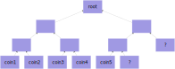

# Cryptographic Schemes

## `PoseidonHash` Function

Poseidon is a circuit friendly permutation hash function described in
the paper [GKRRS2019](https://eprint.iacr.org/2019/458.pdf).

| Parameter         | Setting                        |
|-------------------|--------------------------------|
| S-box             | $x → x⁵$                       |
| Full rounds       | 8                              |
| Partial rounds    | 56                             |

Our usage matches that of the halo2 library. Namely using a sponge configuration
with addition which defines the function
$$\textrm{PoseidonHash} : 𝔽ₚ × ⋯ × 𝔽ₚ → 𝔽ₚ$$

## Bulla Commitments

Given an abstract hash function such as [`PoseidonHash`](#poseidonhash-function),
we use a variant of the commit-and-reveal scheme to define anonymized
representations of objects on chain. Contracts then operate with these anonymous
representations which we call bullas.

Let $\textrm{Params} ∈ 𝔽ₚⁿ$ represent object parameters, then we can define
$$ \textrm{Bulla} : 𝔽ₚⁿ × 𝔽ₚ → 𝔽ₚ $$
$$ \textrm{Bulla}(\textrm{Params}, b) = \textrm{PoseidonHash}(\textrm{Params}, b) $$
where $b ∈ 𝔽ₚ$ is a random blinding factor.

Then the bulla (on chain anonymized representation) can be used in contracts
with ZK proofs to construct statements on $\textrm{Params}$.

## Pallas and Vesta

DarkFi uses the elliptic curves Pallas and Vesta that form a 2-cycle.
We denote Pallas by $ₚ$ and Vesta by $ᵥ$. Set the following values:

$$ p = 0x40000000000000000000000000000000224698fc094cf91b992d30ed00000001 $$
$$ q = 0x40000000000000000000000000000000224698fc0994a8dd8c46eb2100000001 $$

We now construct the base field for each curve $Kₚ$ and $Kᵥ$ as
$Kₚ = 𝔽ₚ$ and $Kᵥ = 𝔽_q$.
Let $f = y² - (x² + 5) ∈ ℤ[x, y]$ be the Weierstrauss normal form of an elliptic curve.
We define $fₚ = f \mod{Kₚ}$ and $fᵥ = f \mod{Kᵥ}$.
Then we instantiate Pallas as $Eₚ = V(fₚ)$ and $Eᵥ = V(fᵥ)$. Now we note the
2-cycle behaviour as

$$ \#V(fₚ) = q $$
$$ \#V(fᵥ) = p $$

An additional projective point at infinity $∞$ is added to the curve.

Let $ℙₚ$ be the group of points with $∞$ on $Eₚ$.

Let $ℙᵥ$ be the group of points with $∞$ on $Eᵥ$.

Arithmetic is mainly done in circuits with $𝔽ₚ$ and $Eₚ$.

### Coordinate Extractor for Pallas

Let $ℙₚ, ∞, 𝔽ₚ$ be defined as [above](#pallas-and-vesta).

Define $\mathcal{X} : ℙₚ → 𝔽ₚ$ such that
$$ \mathcal{X}(∞_{Eₚ}) = 0 $$
$$ \mathcal{X}((x, y)) = x $$
$$ \mathcal{Y}(∞_{Eₚ}) = 0 $$
$$ \mathcal{Y}((x, y)) = y $$

> Note: There is no $P = (0, y) ∈ Eₚ$ so $\mathcal{X}(P) = 0 ⟹  P = ∞$.
> Likewise there is no $P = (x, 0) ∈ Eₚ$ so
> $\mathcal{Y}(P) = 0 ⟹  P = ∞$.

### Hashing to $𝔽ₚ$

Define $𝔹⁶⁴2𝔽ₚ : 𝔹⁶⁴ → 𝔽ₚ$ as the matching decoding of $𝔽ₚ$ modulo
the canonical class in little endian byte format.

Let there by a uniform hash function $h : X → [0, r)$ with $r ≠ p$,
and a map $σ : [0, r) → [0, p)$ converting to the canonical representation
of the class in $ℤ/⟨p⟩$.

Let $s = σ ∘ h$ be the composition of functions, then $s$ has a non-uniform
range. However increasing the size of $r$ relative to $p$ diminises the
statistical significance of any overlap.
For this reason we define the conversion from $𝔹⁶⁴$ for hash functions.

### PubKey Derivation

Let $G_N ∈ ℙₚ$ be the constant `NULLIFIER_K` defined in
`src/sdk/src/crypto/constants/fixed_bases/nullifier_k.rs`.
Since the scalar field of $ℙₚ$ is prime, all points in the group except
the identity are generators.

We declare the function $\t{Lift}_q(x) : 𝔽ₚ → 𝔽ᵥ$. This map is injective since
$\{0, p - 1 \} ⊂ \{0, q - 1\}$.

Define the function
$$ \t{DerivePubKey} : 𝔽ₚ → ℙₚ $$
$$ \t{DerivePubKey}(x) = \t{Lift}_q(x) G_N $$

### Point Serialization

The maximum value of $𝔽ₚ$ fits within 255 bits, with the last bit
of $𝔹³²$ being unused. We use this bit to store the sign of the $y$-coordinate.

We compute the sign of $y = \mathcal{Y}(P)$ for $P ∈ ℙₚ$ by dividing
$𝔽ₚ$ into even and odd sets. Let $\t{sgn}(y) = y \mod{2}$.

We define $ℙₚ2𝔹³² : ℙₚ → 𝔹³²$ as follows. Let $P ∈ ℙₚ$, then

$$ ℙₚ2𝔹³² = \begin{cases}
ℕ2𝔹³²(0) & \text{if } P = ∞ \\
ℕ2𝔹³²(\mathcal{X}(P) + 2²⁵⁵\t{sgn}(\mathcal{Y}(P)) & \text{otherwise}
\end{cases} $$

> Security note: apart from the case when $P = ∞$, this function is
> mostly constant time. In cases such as key agreement, where constant
> time decryption is desirable and $P ≠ ∞$ is mostly guaranteed, this
> provides a strong approximation.

## Group Hash

Let $\t{GroupHash} : 𝔹^* × 𝔹^* → ℙₚ$ be the hash to curve function
defined in [ZCash Protocol Spec, section 5.4.9.8](https://zips.z.cash/protocol/protocol.pdf#concretegrouphashpallasandvesta).
The first input element acts as the domain separator to distinguish
uses of the group hash for different purposes, while the second input is
the actual message.

The main components are:

* An isogeny map $\t{iso\_map}^𝔾 : \t{iso-}𝔾 → 𝔾$ which is a group homomorphism
  from $ℙₚ$ to a curve $\t{iso-}ℙₚ$ with $a_{\t{iso-}ℙₚ}, b_{\t{iso-}ℙₚ} ≠ 0$
  which is required by the group hash.
  See [IETF: Simplified SWU for AB == 0](https://www.ietf.org/archive/id/draft-irtf-cfrg-hash-to-curve-10.html#name-simplified-swu-for-ab-0-2).
* [`hash_to_field` implementation](https://www.ietf.org/archive/id/draft-irtf-cfrg-hash-to-curve-10.html#name-hash_to_field-implementation)
  which maps a byte array to the scalar field $𝔽_q$.
* [`map_to_curve_simple_swu(u)`](https://www.ietf.org/archive/id/draft-irtf-cfrg-hash-to-curve-10.html#simple-swu)
  which maps $u ∈ 𝔽_q$ to a curve point $\t{iso-}ℙₚ$.

Then $\t{GroupHash}(D, M)$ is calculated as follows:

Let $\t{DST} = D || \textbf{"-pallas\_XMD:BLAKE2b\_SSWU\_RO\_"}$

Assert $\t{len}(DST) ≤ 255$

Let $(u₁, u₂) = \t{hash\_to\_field}(M, \t{DST})$

For $i ∈ [2]$

&emsp; Let $Qᵢ = \t{map\_to\_curve\_simple\_swu}(uᵢ)$

Return $\t{iso\_map}^{ℙₚ}(Q₁ + Q₂)$

## BLAKE2b Hash Function

BLAKE2 is defined by [ANWW2013](https://blake2.net/#sp).
Define the BLAKE2b variant as
$$ \t{BLAKE2b}ₙ: 𝔹^* → 𝔹ⁿ $$

## Homomorphic Pedersen Commitments

Let $\t{GroupHash}$ be defined as in [Group Hash](#group-hash).

Let $\t{Lift}_q$ be defined as in [Pubkey Derivation](#pubkey-derivation).

When instantiating value commitments, we require the homomorphic property.

Define:
$$ G_V = \t{GroupHash}(\textbf{"z.cash:Orchard-cv"}, \textbf{"v"}) $$
$$ G_B = \t{GroupHash}(\textbf{"z.cash:Orchard-cv"}, \textbf{"r"}) $$
$$ \t{PedersenCommit} : 𝔽ₚ × 𝔽ᵥ → ℙₚ $$
$$ \t{PedersenCommit}(v, b) = \t{Lift}_q(v) G_V + b G_B $$

This scheme is a computationally binding and perfectly hiding commitment scheme.

## Incremental Merkle Tree

Let $ℓᴹ = 32$ be the merkle depth.

The incremental merkle tree is fixed depth of $ℓᴹ$ used to store $𝔽ₚ$ items.
It is an append-only set for which items can be proved to be inside within
ZK. The root value is a commitment to the entire tree.

Denote combining two nodes to produce a parent by the operator
$⊕ : 𝔽ₚ × 𝔽ₚ → 𝔽ₚ$. Denote by $⊕_b$ where $b ∈ ℤ₂$, the function which
swaps both arguments before calling $⊕$, that is
$$ ⊕_b(X₁, X₂) = \begin{cases}
⊕(X₁, X₂) & \text{if } b = 0 \\
⊕(X₁, X₂) & \text{if } b = 1 \\
\end{cases} $$

We correspondingly define the types
$$ \t{MerklePos} = ℤ₂^{ℓᴹ} $$
$$ \t{MerklePath} = 𝔽ₚ^{ℓᴹ} $$
and a function to calculate the root given a leaf, its position and the path,
$$ \t{MerkleRoot} : \t{MerklePos} × \t{MerklePath} × 𝔽ₚ → 𝔽ₚ $$
$$ \t{MerkleRoot}(𝐩, \mathbf{Π}, ℬ ) = ⊕_{p_{ℓᴹ}}(…, ⊕_{p₂}(π₂, ⊕_{p₁}(π₁, ℬ ))…) $$

## Symmetric Encryption

Let $\t{Sym}$ be an *authenticated one-time symmetric encryption scheme*
instantiated as AEAD_CHACHA20_POLY1305 from [RFC 7539](https://www.rfc-editor.org/rfc/rfc7539).
We use a nonce of $ℕ2𝔹¹²(0)$ with a 32-byte key.

Let $K = 𝔹³²$ represent keys, $N = 𝔹^*$ for plaintext data and $C = 𝔹^*$ for ciphertexts.

$\t{Sym}.\t{Encrypt} : K × N → C$ is the encryption algorithm.

$\t{Sym}.\t{Decrypt} : K × C → N ∪ \{ ⟂ \}$ is the decryption algorithm,
such that for any $k ∈ K$ and $p ∈ P$, we have
$$ \t{Sym}.\t{Decrypt}(k, \t{Sym}.\t{Encrypt}(k, p)) = p $$
we use $⟂$ to represent the decryption of an invalid ciphertext.

**Security requirement:** $\t{Sym}$ must be *one-time* secure. One-time here
means that an honest protocol participant will almost surely encrypt only
one message with a given key; however, the adversary may make many adaptive
chosen ciphertext queries for a given key.

## Key Agreement

Let $𝔽ₚ, ℙₚ, \t{Lift}_q$ be defined as in the section [Pallas and Vesta](#pallas-and-vesta).

A *key agreement scheme* is a cryptographic protocol in which two parties
agree on a shared secret, each using their *private key* and the other
party's *public key*.

Let $\t{KeyAgree} : 𝔽ₚ × ℙₚ → ℙₚ$ be defined as $\t{KeyAgree}(x, P) = \t{Lift}_q(x) P$.

## Key Derivation

Let $\t{BLAKE2b}ₙ$ be defined as in the section [BLAKE2b Hash Function](#blake2b-hash-function).

Let $ℙₚ, ℙₚ2𝔹³²$ be defined as in the section [Pallas and Vesta](#pallas-and-vesta).

A *Key Derivation Function* is defined for a particular *key agreement scheme*
and *authenticated one-time symmetric encryption scheme*; it takes the
shared secret produced by the key agreement and additional arguments, and
derives a key suitable for the encryption scheme.

$\t{KDF}$ takes as input the shared Diffie-Hellman secret $x$ and the
*ephemeral public key* $\t{EPK}$. It derives keys for use with
$\t{Sym}.\t{Encrypt}$.
$$ \t{KDF}: ℙₚ × ℙₚ → 𝔹³² $$
$$ \t{KDF}(P, \t{EPK}) = \t{BLAKE2b}₃₂(ℙₚ2𝔹³²(P) || ℙₚ2𝔹³²(\t{EPK})) $$

## In-band Secret Distribution

Let $\t{Sym}.\t{Encrypt}, \t{Sym}.\t{Decrypt}$ be defined as in the section [Symmetric Encryption](#symmetric-encryption).

Let $\t{KeyAgree}$ be defined as in the section [Key Agreement](#key-agreement).

Let $\t{KDF}$ be defined as in the section [Key Derivation](#key-derivation).

Let $𝔽ₚ, ℙₚ, \t{DerivePubKey}$ be defined as in the section [Pallas and Vesta](#pallas-and-vesta).

To transmit secrets securely to a recipient *without* requiring an out-of-band
communication channel, we use the [key derivation function](#key-derivation)
together with [symmetric encryption](#symmetric-encryption).

Denote $\t{AeadEncNote}ₙ = (E, C)$ where $E$ is the space of *ephemeral
public keys* and $C$ is the ciphertext space.

See `AeadEncryptedNote` in `src/sdk/src/crypto/note.rs`.

### Encryption

We let $P ∈ ℙₚ$ denote the recipient's public key.
Let $\t{note} ∈ N = 𝔹^*$ denote the plaintext note to be encrypted.

Let $\t{esk} ∈ 𝔽ₚ$ be the randomly generated *ephemeral secret key*.

Let $\t{EPK} = \t{DerivePubKey}(\t{esk}) ∈ ℙₚ$

Let $\t{shared\_secret} = \t{KeyAgree}(\t{esk}, P)$

Let $k = \t{KDF}(\t{shared\_secret}, \t{EPK})$

Let $c = \t{Sym}.\t{Encrypt}(k, \t{note})$

Return $c$

### Decryption

We denote the recipient's secret key with $x ∈ 𝔽ₚ$.
Let $c ∈ C = 𝔹^*$ denote the ciphertext note to be decrypted.

The recipient receives the *ephemeral public key* $\t{EPK} ∈ ℙₚ$ used to decrypt
the ciphertext note $c$.

Let $\t{shared\_secret} = \t{KeyAgree}(x, \t{EPK})$

Let $k = \t{KDF}(\t{shared\_secret}, \t{EPK})$

Let $\t{note} = \t{Sym}.\t{Decrypt}(k, c)$. If $\t{note} = ⟂$ then
return $⟂$, otherwise return $\t{note}$.

## Verifiable In-Band Secret Distribution

Let $\t{PoseidonHash}$ be defined as in the section [PoseidonHash Function](#poseidonhash-function).

This scheme is verifiable inside ZK using the [Pallas and Vesta](#pallas-and-vesta) curves.

Let $n ∈ ℕ$.
Denote the plaintext space $Nₖ$ and ciphertext $Cₖ$ with $Nₖ = Cₖ = 𝔽ₚᵏ$ where $k ∈ ℕ$.

Denote $\t{ElGamalEncNote}ₖ = (E, Cₖ)$ where $E$ is the space of *ephemeral
public keys* and $C$ is the ciphertext space.

See `ElGamalEncryptedNote` in `src/sdk/src/crypto/note.rs`.

### Encryption

We let $P ∈ ℙₚ$ denote the recipient's public key.
Let $𝐧 ∈ N$ denote the plaintext note to be encrypted.

Define $\t{ElGamal}.\t{Encrypt} : Nₖ × 𝔽ₚ × ℙₚ → Cₖ × ℙₚ$
by $\t{ElGamal}.\t{Encrypt}(𝐧, P)$ as follows:

Let $\t{esk} ∈ 𝔽ₚ$ be the randomly generated *ephemeral secret key*.

Let $\t{EPK} = \t{DerivePubKey}(\t{esk}) ∈ ℙₚ$

Let $\t{shared\_secret} = \t{KeyAgree}(\t{esk}, P)$

Let $k = \t{PoseidonHash}(\cX(\t{shared\_secret}), \cY(\t{shared\_secret}))$

For $i ∈ [k]$ then compute:

&emsp; Let $bᵢ = \t{PoseidonHash}(k, i)$

&emsp; Let $cᵢ = \t{note}ᵢ + bᵢ$

Return $(𝐜, \t{EPK})$ where $𝐜 = (cᵢ)$

### Decryption

We denote the recipient's secret key with $x ∈ 𝔽ₚ$.
The recipient receives the *ephemeral public key* $\t{EPK} ∈ ℙₚ$ used to decrypt
the ciphertext note $𝐜 ∈ Cₖ$.

Define $\t{ElGamal}.\t{Decrypt} : Cₖ × 𝔽ₚ × ℙₚ → Nₖ$
by $\t{ElGamal}.\t{Decrypt}(𝐜, x, \t{EPK})$ as follows:

Let $\t{shared\_secret} = \t{KeyAgree}(x, \t{EPK})$

Let $k = \t{PoseidonHash}(\cX(\t{shared\_secret}), \cY(\t{shared\_secret}))$

For $i ∈ [k]$ then compute:

&emsp; Let $bᵢ = \t{PoseidonHash}(k, i)$

&emsp; Let $nᵢ = cᵢ - bᵢ$

Return $𝐧 = (nᵢ)$

