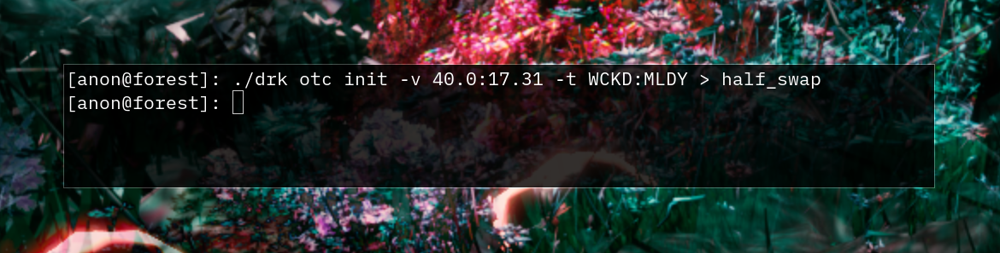
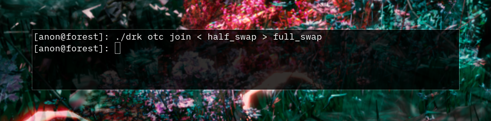
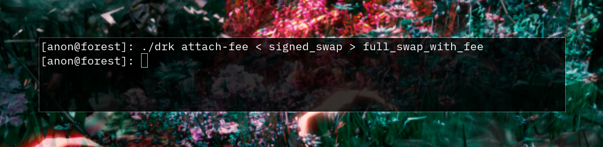
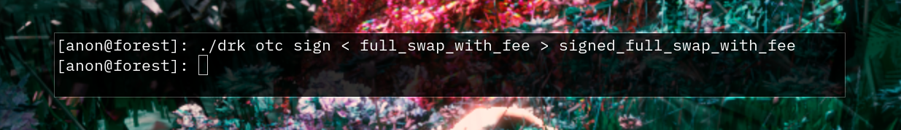
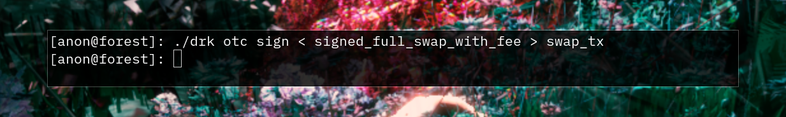
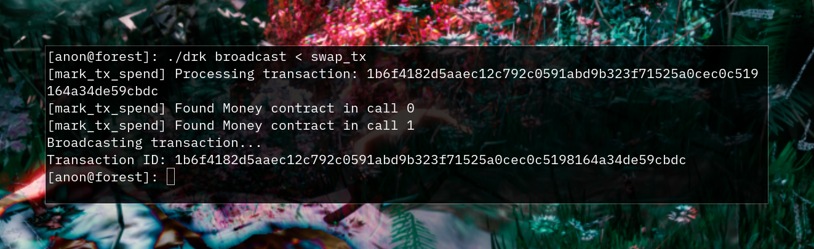
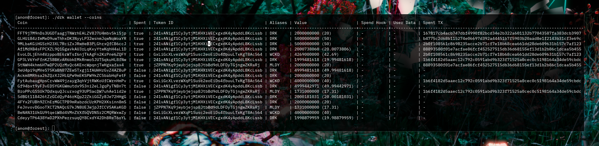

# Atomic Swaps

In order to do an atomic swap with someone, you will first have to agree
on what tokens you wish to swap. For example purposes, let's say you want
to swap `40` `WCKD` (which is the balance you should have left over after
doing the payment from the previous page) for your counterparty's `17.31`
`MLDY`. For this tutorial the counterparty is yourself.

To protect your anonymity from the counterparty, the swap can only send
entire coins. To create a smaller coin denomination, send yourself the
amount you want to swap. Then check you have a spendable coin to swap
with. Note that the coin overview might look very different depending
on your activity:

```
$ ./drk wallet --coins
```


You'll have to initiate the swap and build your half of the swap tx:

```
$ ./drk otc init -v 40.0:17.31 -t WCKD:MLDY > half_swap
```



Then you can send this `half_swap` file to your counterparty and they
can create the other half by running:

```
$ ./drk otc join < half_swap > full_swap
```



They will sign the full_swap file and send it back to you. Finally,
to make the swap transaction valid, you need to sign it as well

```
$ ./drk otc sign < full_swap > signed_swap
```


Now that the swap is signed, one of the parties (or a third one)
must attach the corresponding fee:

```
$ ./drk attach-fee < signed_swap > full_swap_with_fee
```



Since a new call has been added to the transaction, both parties
must re-sign the full_swap_with_fee file, one by one.

Party A:

```
$ ./drk otc sign < full_swap_with_fee > signed_full_swap_with_fee
```



Party B:

```
$ ./drk otc sign < signed_full_swap_with_fee > swap_tx
```



Now the complete swap transaction can be broadcasted:

```
$ ./drk broadcast < swap_tx
```



On success, you should see a transaction ID. This transaction will now
also be in the mempool, so you should wait again until it's confirmed.


After a while you should see the change in balances in your wallet:

```
$ ./drk wallet --balance
```


Since in this example we did an atomic swap with ourself, the balances are
unchanged. We can confirm it actually happened successfully by checking
our coins:

```
$ ./drk wallet --coins
```



Here you can see there are two entries for the tokens we used in the
swap: 17.31 MLDY and 40.00 WCKD. The first entry shows the `Spent` flag
as `true` and the second entry shows the `Spent` flag as `false`. This
means the transaction was successful. Since we are swapping with ourself,
we successfully spent the coins in the first half of the transaction,
and re-minted to ourselves them in the second half of the transaction.

If you're testing atomic swaps with a counterparty and you can see
their tokens, that means the swap was successful.  In case you still
see your old tokens, that could mean that the swap transaction has not
yet been confirmed.
