Compiling and Running a Node
=========================

Please read the whole document first before executing commands, to
understand all the steps required and how each component operates.
Unless instructed otherwise, each daemon runs on its own shell, so don't
stop a running one to start another.

We also strongly suggest to first execute next guide steps on a
[local environment](#local-deployment) to become familiar with
each command, before broadcasting transactions to the actual network.

## Overview

This tutorial will cover the three DarkFi blockchain components and
their current features. The components covered are:

* `darkfid` is the DarkFi fullnode. It validates blockchain transactions
and stays connected to the p2p network. 
* `drk` is a CLI wallet. It provides an interface to smart contracts such
as Money and DAO, manages our keys and coins, and scans the blockchain
to update our balances.
* `minerd` is the DarkFi mining daemon. `darkfid` connects to it over
RPC, and triggers commands to mine blocks.

The config files for `darkfid` and `drk` are sectioned into three parts,
each marked `[network_config]`. The sections look like this:

* `[network_config."testnet"]`
* `[network_config."mainnet"]`
* `[network_config."localnet"]`

At the top of the `darkfid` and `drk` config file, we can modify the
network being used by changing the following line:

```
# Blockchain network to use
network = "testnet"
```

This enables us to configure `darkfid` and `drk` for different contexts,
namely mainnet, testnet and localnet. Mainnet is not active yet. Localnet
can be setup by following the instructions [here](#local-deployment). The
rest of this tutorial assumes we are setting up a testnet node.

## Compiling

Since this is still an early phase, we will not be installing any of
the software system-wide. Instead, we'll be running all the commands
from the git repository, so we're able to easily pull any necessary
updates.

Refer to the main [DarkFi](../index.html) page for instructions on how
to install Rust and necessary deps.

Once you have the repository in place, and everything is installed, we
can compile the `darkfid` node and the `drk` wallet CLI:

```
$ make darkfid drk
```

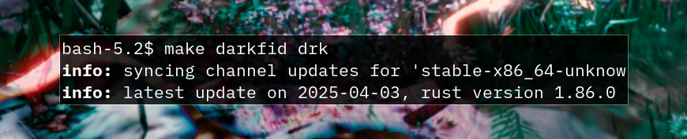

This process will now compile the node and the wallet CLI tool.
When finished, we can begin using the network. Run `darkfid` and `drk`
once so their config files are spawned on your system. These config files
will be used to `darkfid` and `drk`.

Please note that the exact paths may differ depending on your local setup.

```
$ ./darkfid
Config file created in "~/.config/darkfi/darkfid_config.toml". Please review it and try again.
```

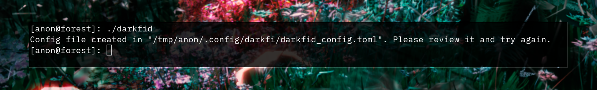

```
$ ./drk wallet --address
Config file created in "~/.config/darkfi/drk_config.toml". Please review it and try again.
```

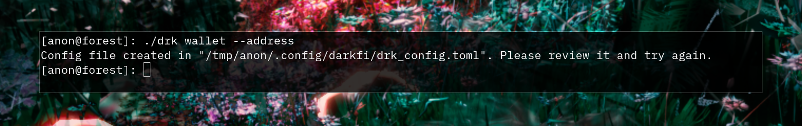

## Running

### Using Tor

DarkFi supports Tor for network-level anonymity. To use the testnet over
Tor, you'll need to make some modifications to the `darkfid` config
file.

For detailed instructions and configuration options on how to do this,
follow the [Tor Guide](../misc/nodes/tor-guide.md#configure-network-settings).

### Wallet initialization

Now it's time to initialize your wallet. For this we use `drk`, a separate
wallet CLI which is created to interface with the smart contract used
for payments and swaps.

First, you need to change the password in the `drk` config. Open
your config file in a text editor (the default path is
`~/.config/darkfi/drk_config.toml`). Look for the section marked
`[network_config."testnet"]` and change this line:

```
# Password for the wallet database
wallet_pass = "changeme"
```

Once you've changed the default password for your testnet wallet, we can
proceed with the wallet initialization. We simply have to initialize a
wallet, and create a keypair.

```
$ ./drk wallet --initialize
```

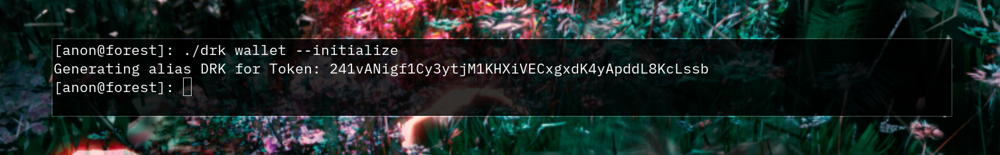

```
$ ./drk wallet --keygen
```

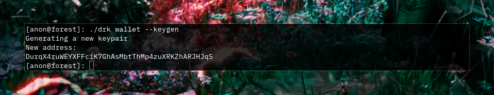

```
$ ./drk wallet --default-address 1
```

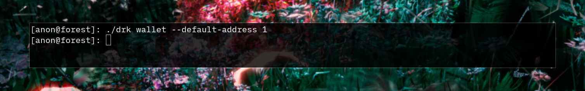

The second command will print out your new DarkFi address where you
can receive payments. Take note of it. Alternatively, you can always
retrieve your default address using:

```
$ ./drk wallet --address
```

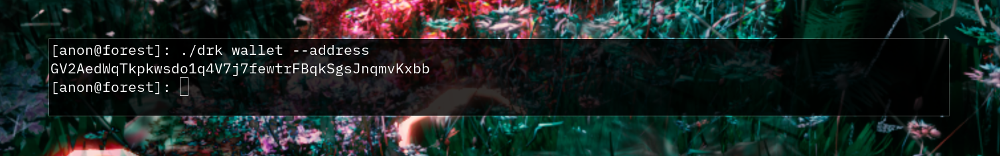

### Miner

It's not necessary for broadcasting transactions or proceeding with the
rest of the tutorial (`darkfid` and `drk` handle this), but if you want
to help secure the network, you can participate in the mining process
by running the native `minerd` mining daemon.

To mine on DarkFI we need to expose the `minerd` RPC to the `darkfid`
full node, which will initiate the mining process. We'll also need to
add a recipient to `darkfid` that specifies where the mining rewards
will be minted to. 

First, compile it:

```
$ make minerd
```


This process will now compile the mining daemon. When finished, run
`minerd` once so that it spawns its config file on your system. This
config file is used to configure `minerd`. You can define how many
threads will be used for mining. RandomX can use up to 2080 MiB per
thread so configure it to not consume all your system available memory.

```
$ ./minerd
Config file created in "~/.config/darkfi/minerd_config.toml". Please review it and try again.
```

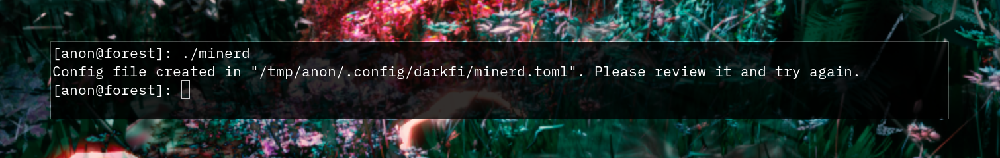

Once that's in place, you can run it again and `minerd` will start,
waiting for requests to mine blocks.

```
$ ./minerd
```

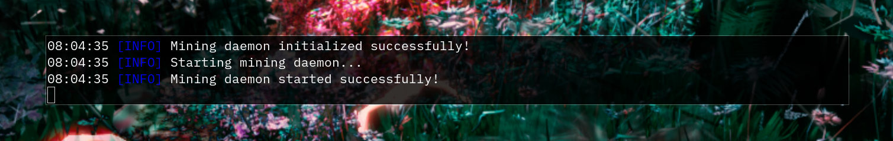

You now have to expose `minerd` RPC to `darkfid`, and configure it
to use your wallet address as the rewards recipient, when submitting
blocks to `minerd` to mine.

Open your `darkfid` config file with a text editor (the default path
is `~/.config/darkfi/darkfid_config.toml`). Find the `recipient` and
`minerd_endpoint` options under `[network_config."testnet"]`, and
uncomment them by removing the `#` character at the start of line,
like this:

```
# Put your `minerd` endpoint here (default for testnet is in this example)
minerd_endpoint = "tcp://127.0.0.1:28467"
# Put the address from `drk wallet --address` here
recipient = "YOUR_WALLET_ADDRESS_HERE"
```

Now ensure that `minerd_endpoint` is set to the same value as the
`rpc_listen` address in your `minerd` config (the default path
is `~/.config/darkfi/minerd_config.toml`). Finally, replace the
`YOUR_WALLET_ADDRESS_HERE` string with your `drk` wallet address that
you can retrieve as follows:

```
$ ./drk wallet --address
```


Note: when modifying the `darkfid` config file to use with the
testnet, be sure to change the values under the section marked
`[network_config."testnet"]` (not localnet or mainnet!).

### Darkfid

Now that `darkfid` configuration is in place, you can run it again and
`darkfid` will start, create the necessary keys for validation of blocks
and transactions, and begin syncing the blockchain. 

```
$ ./darkfid
```

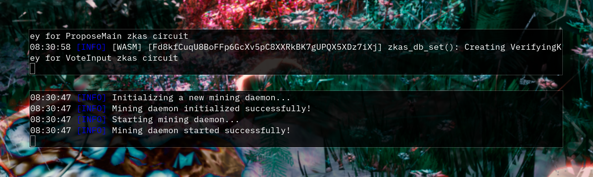

As its syncing, you'll see periodic messages like this:

```
[INFO] Blocks received: 4020/4763
```

This will give you an indication of the current progress. Keep it running,
and you should see a `Blockchain synced!` message after some time.

If you're running `minerd`, you should see a notification from the
`minerd` terminal like this:

```
[INFO] [RPC] Server accepted conn from tcp://127.0.0.1:44974/
```

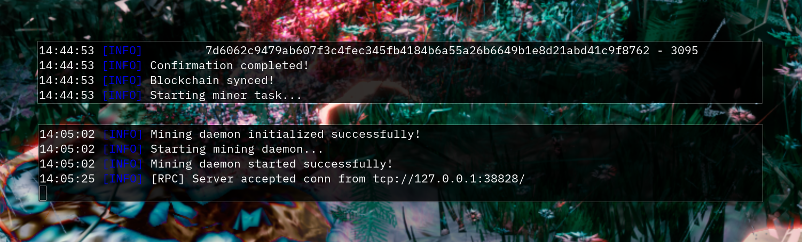

This means that `darkfid` and `minerd` are connected over RPC and `minerd`
can start mining.

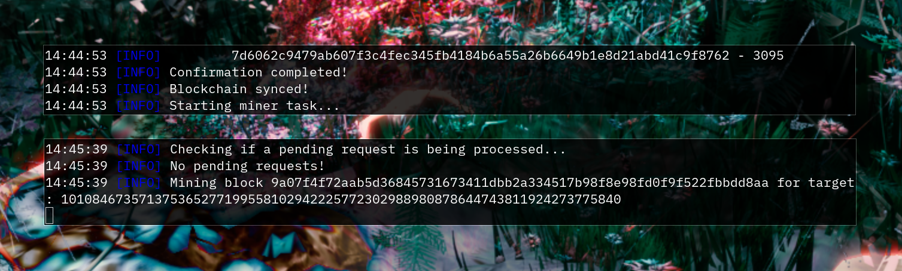

When `darkfid` and `minerd` are correctly connected and you get an error
like this:

```
[ERROR] minerd::rpc: Failed mining block f6b4a0f0c8f90905da271ec0add2e856939ef3b0d6cd5b28964d9c2b6d0a0fa9 with error: Miner task stopped
```

That's expected behavior. It means your setup is correct and you are
mining blocks. `Failed mining block` happens when a new block was
received by `darkfid`, extending the current best fork, so it sends an
interuption message to `minerd` to stop mining the current block and
start mining the next height one.

Otherwise, you'll see a notification like this:

```
[INFO] Mined block b6c7bd3545daa81d0e2e56ee780363beef6eb5b54579f54dca0cdd2a59989b76 with nonce: 266292
```

Which means the current height block has been mined succesfully by
`minerd` and propagated to `darkfid` so it can broadcast it to the
network.

### Wallet sync

In order to receive incoming coins, you'll need to use the `drk`
tool to subscribe on `darkfid` so you can receive notifications for
incoming blocks. The blocks have to be scanned for transactions,
and to find coins that are intended for you. In another terminal,
you can run the following commands to first scan the blockchain,
and then to subscribe to new blocks:

```
$ ./drk scan
```

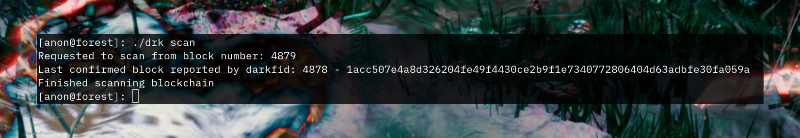

```
$ ./drk subscribe
```

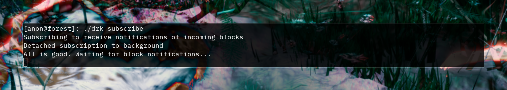

Now you can leave the subscriber running. In case you stop it, just
run `drk scan` again until the chain is fully scanned, and then you
should be able to subscribe again.

## Local Deployment

For local (non-testnet) development we recommend running master, and
use the existing `contrib/localnet/darkfid-single-node` folder, which
provides the corresponding configurations to operate.

First, compile `darkfid` node, `minerd` mining daemon and the `drk`
wallet CLI:

```
$ make darkfid minerd drk
```

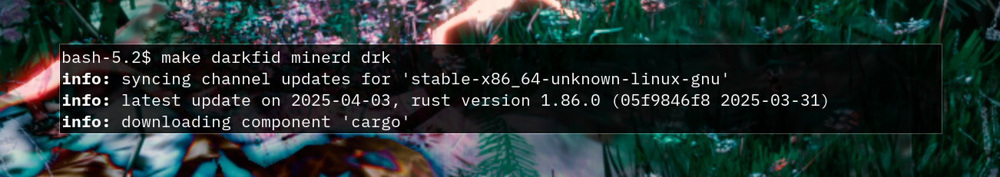

Enter the localnet folder, and initialize a wallet:

```
$ cd contrib/localnet/darkfid-single-node/
$ ./init-wallet.sh
```

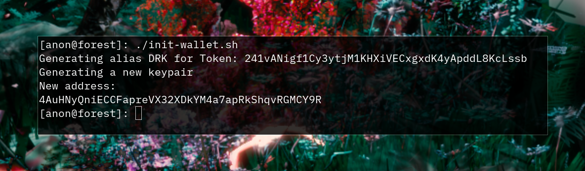

Then start `darkfid` and wait until its initialized:

```
$ ./tmux_sessions.sh
```

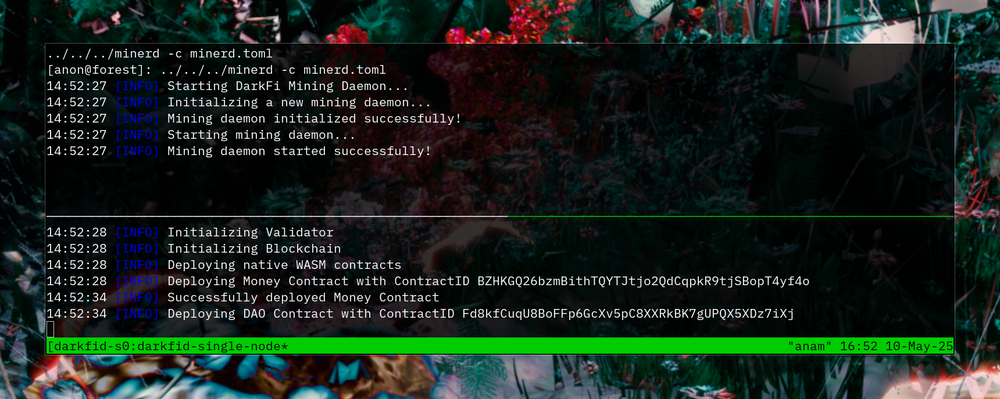

After some blocks have been generated we
will see some `DRK` in our test wallet.
On a different shell(or tmux pane in the session),
navigate to `contrib/localnet/darkfid-single-node`
folder again and check wallet balance

```
$ ./wallet-balance.sh
```
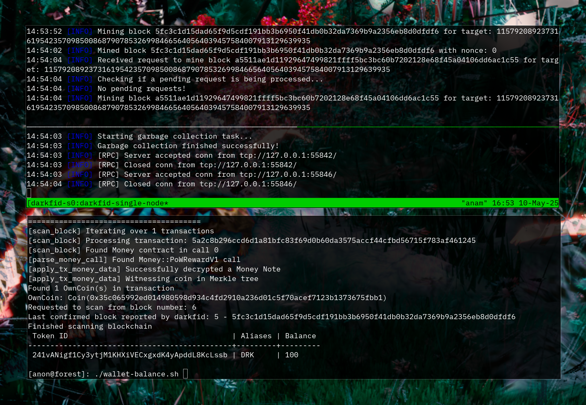

Don't forget that when using this local node, all operations
should be executed inside the `contrib/localnet/darkfid-single-node`
folder, and `./drk` command to be replaced by `../../../drk -c drk.toml`

## Advanced Usage

To run a node in full debug mode:

```
$ LOG_TARGETS='!sled,!rustls,!net' ./darkfid -vv | tee /tmp/darkfid.log
```

The `sled` and `net` targets are very noisy and slow down the node so
we disable those.

We can now view the log, and grep through it.

```
$ tail -n +0 -f /tmp/darkfid.log | grep -a --line-buffered -v DEBUG
```

