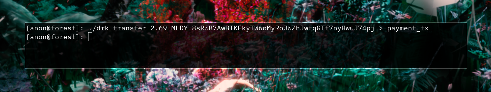
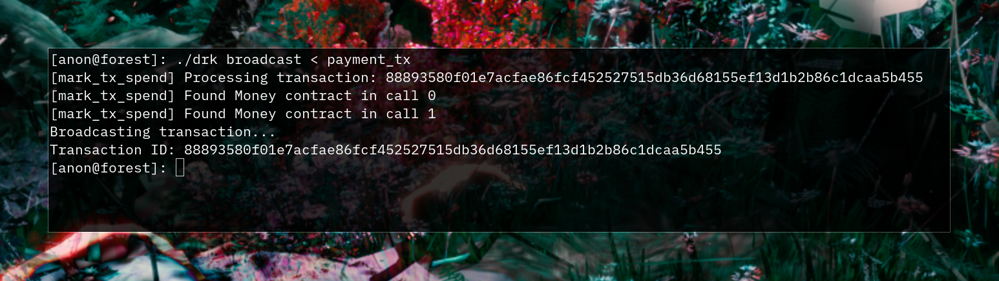
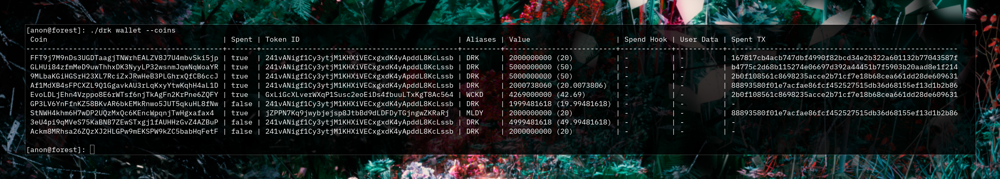
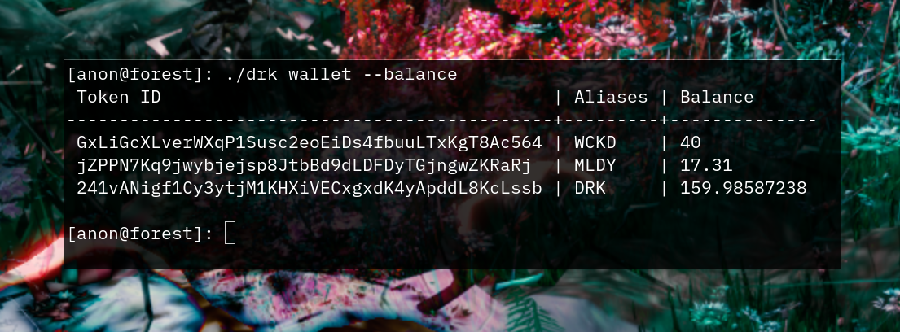

# Payments

Using the tokens we minted, we can make payments to other addresses.
Let's try to send some `MLDY`
tokens to `8sRwB7AwBTKEkyTW6oMyRoJWZhJwtqGTf7nyHwuJ74pj`:

```
$ ./drk transfer 2.69 MLDY \
    8sRwB7AwBTKEkyTW6oMyRoJWZhJwtqGTf7nyHwuJ74pj > payment_tx
```



The above command will create a transfer transaction and place it into
the file called `payment_tx`. Then we can broadcast this transaction
to the network:

```
$ ./drk broadcast < payment_tx
```



On success we'll see a transaction ID. Now again the same confirmation
process has to occur and `8sRwB7AwBTKEkyTW6oMyRoJWZhJwtqGTf7nyHwuJ74pj`
will receive the tokens you've sent.


We can see the spent coin in our wallet.

```
$ ./drk wallet --coins
```


We have to wait until the next block to see our change balance reappear
in our wallet.

```
$ ./drk wallet --balance
```



