# Native token

Now that you have your wallet set up, you will need some native `DRK`
tokens in order to be able to perform transactions, since that token
is used to pay the transaction fees. You can obtain `DRK` either by
successfully mining a block that gets confirmed or by asking for some
by the community on `darkirc` and/or your comrades. Don't forget to
tell them to add the `--half-split` flag when they create the transfer
transaction, so you get more than one coins to play with.

After you request some `DRK` and the other party submitted a transaction
to the network, it should be in the consensus' mempool, waiting for
inclusion in the next block(s). Depending on the network, confirmation
of the blocks could take some time. You'll have to wait for this to happen.
If your `drk subscribe` is running, then after some time your new balance
should be in your wallet.


You can check your wallet balance using `drk`:

```
$ ./drk wallet --balance
```

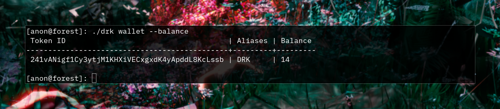

# Creating tokens

On the DarkFi network, we're able to mint custom tokens with some
supply. To do this, we need to generate a mint authority keypair,
and derive a token ID from it. We can simply do this by executing the
following command:

```
$ ./drk token generate-mint
```

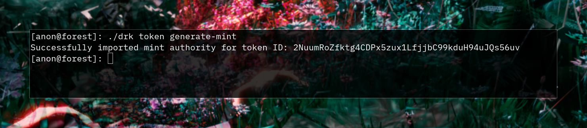

This will generate a new token mint authority and will tell you what
your new token ID is.

You can list your mint authorities with:

```
$ ./drk token list
```

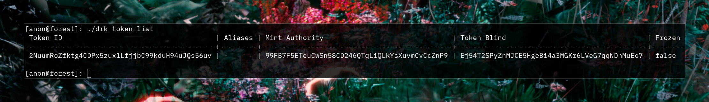

For this tutorial we will need two tokens so execute the command again
to generate another one.

```
$ ./drk token generate-mint
```

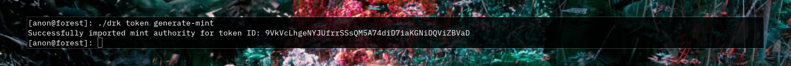

Verify you have two tokens by running:

```
$ ./drk token list
```

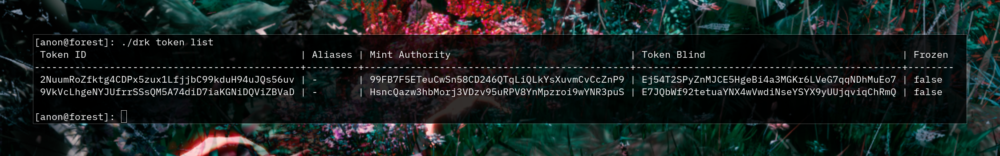

## Aliases

To make our life easier, we can create token ID aliases, so when we
are performing transactions with them, we can use that instead of the
full token ID. Multiple aliases per token ID are supported.

Example addition:

```
$ ./drk alias add {ALIAS} {TOKEN}
```

The native token alias `DRK` should already exist, and we can use that
to refer to the native token when executing transactions using it.

We can also list all our aliases using:

```
$ ./drk alias show
```

Note: these aliases are only local to your machine. When exchanging
with other users, always verify that your aliases' token IDs match.

Now let's add the two token IDs generated earlier to our aliases:

```
$ ./drk alias add WCKD {TOKEN1}
```

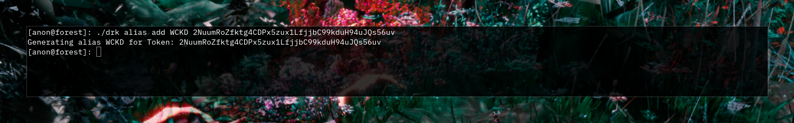

```
$ ./drk alias add MLDY {TOKEN2}
```

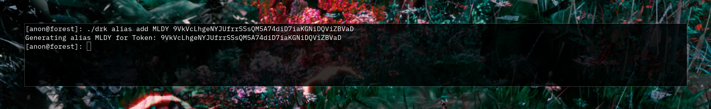

```
$ ./drk alias show
```

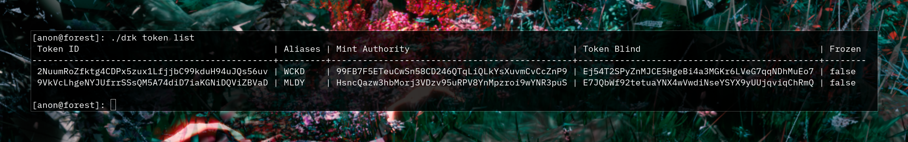

## Mint transaction

Now let's mint some tokens for ourselves. First grab your wallet address,
and then create the token mint transaction, and finally - broadcast it:

```
$ ./drk wallet --address
```


```
$ ./drk token mint WCKD 42.69 {YOUR_ADDRESS} > mint_tx
```

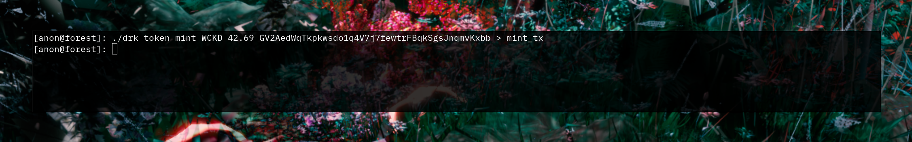

```
$ ./drk broadcast < mint_tx
```

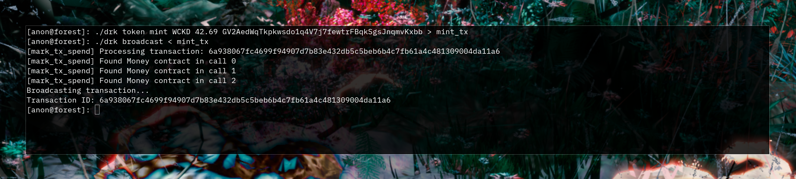

```
$ ./drk token mint MLDY 20.0 {YOUR_ADDRESS} > mint_tx
```

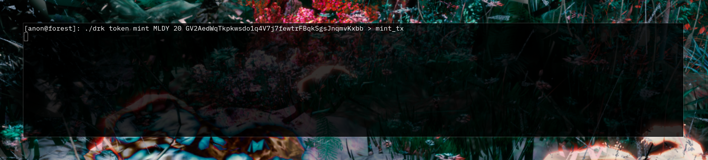

```
$ ./drk broadcast < mint_tx
```

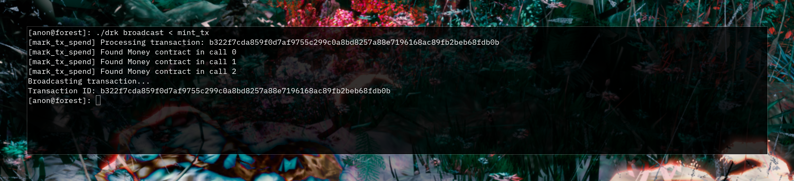

Now the transaction should be published to the network. If you have
an active block subscription (which you can do with `drk subscribe`),
then when the transaction is confirmed, your wallet should have your
new tokens listed when you run:

```
$ ./drk wallet --balance
```

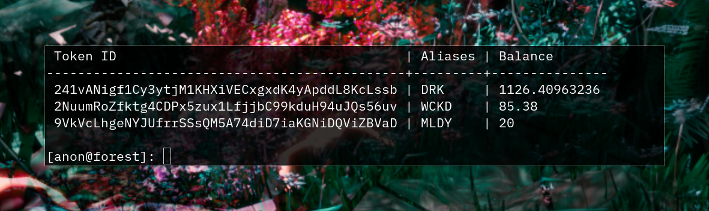

*Note that the WCKD balance in the above image is 2x the expected about
of 42.69 (i.e.  85.38). This is not a bug, it's because we accidentally
applied the mint_tx twice. Yay!*
