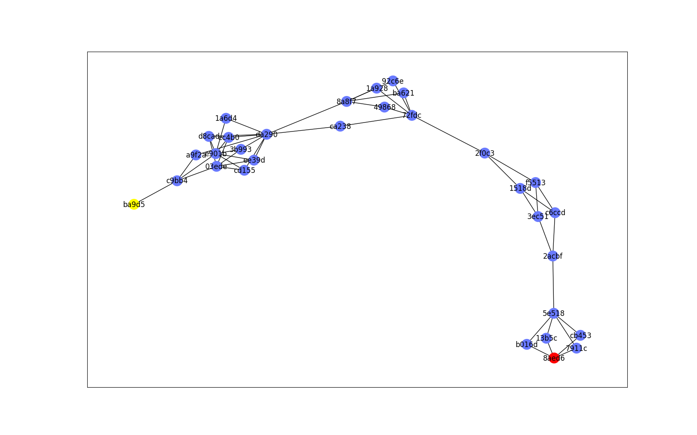
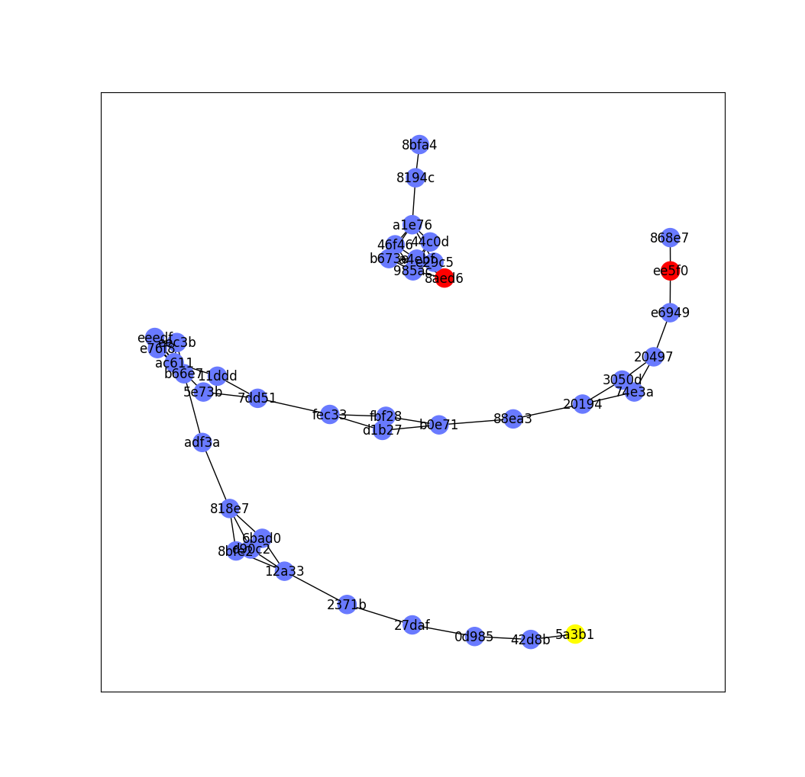
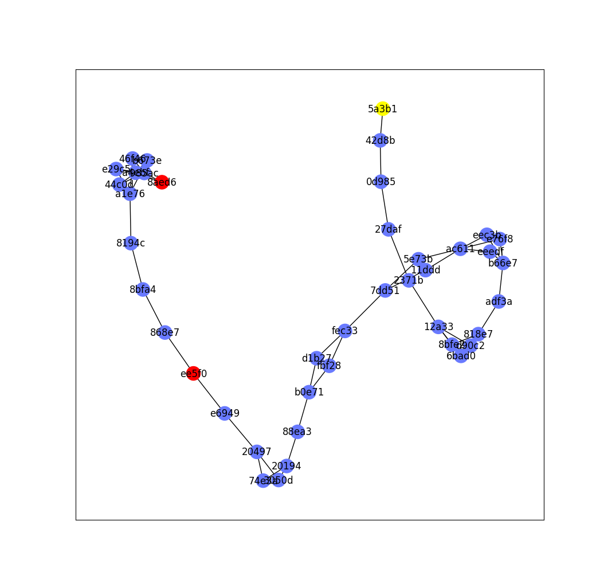
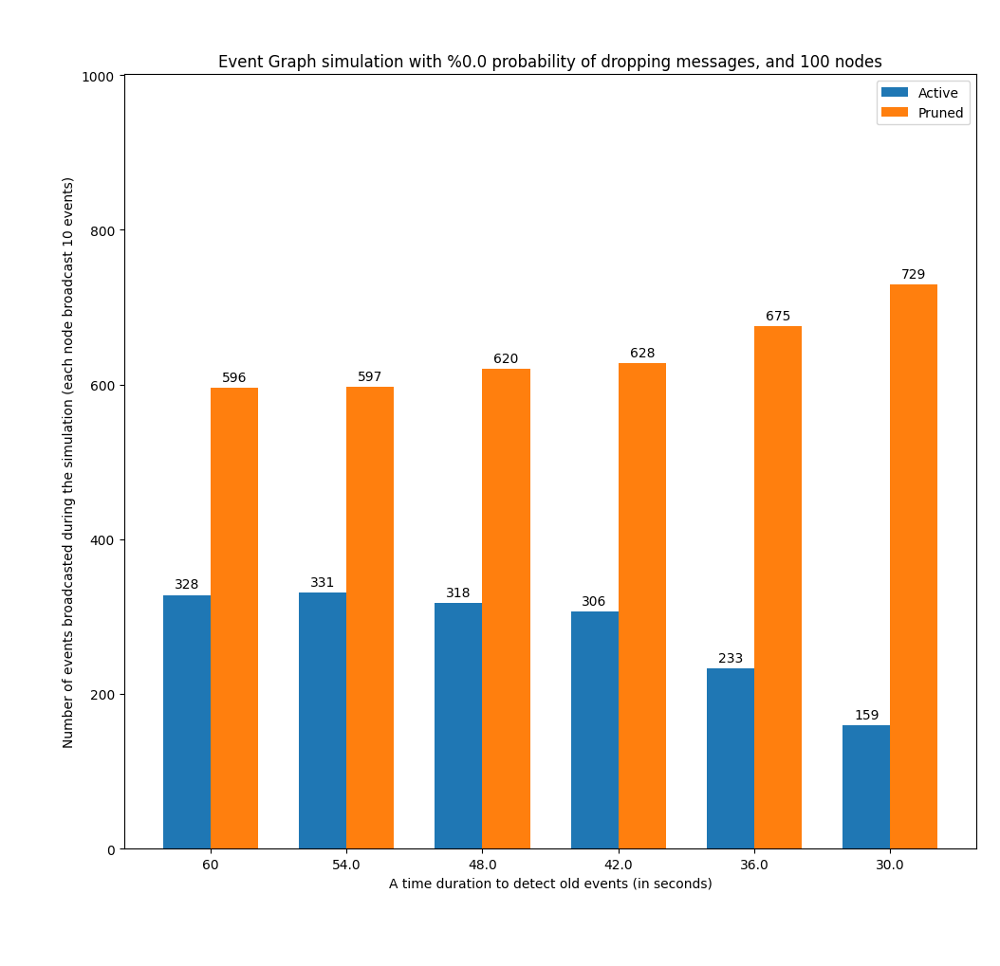

# Introduction 

TODO: paragraph here on what is the event graph. what is the motivation

TODO: paragraph describing how it works from a high level

# Graphs

## Number of nodes increase with fixed probability of dropping messages  

TODO: description here of the graphs

## Probability of dropping messages increase with fixed number of nodes 

TODO: description here of the graphs

### The probability reach to 100% for dropping messages 

TODO: description here of the graphs

## Pruning old events

TODO: description here of the graphs

### The synchronization process with pruning the graph from old events

TODO: description here of the graphs

