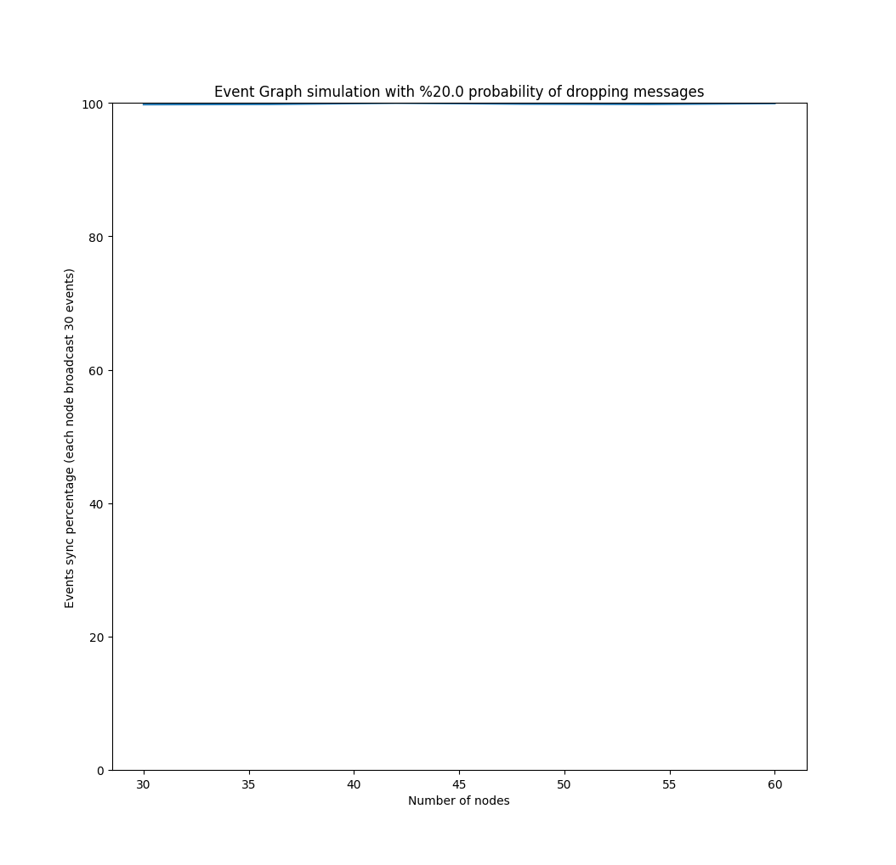
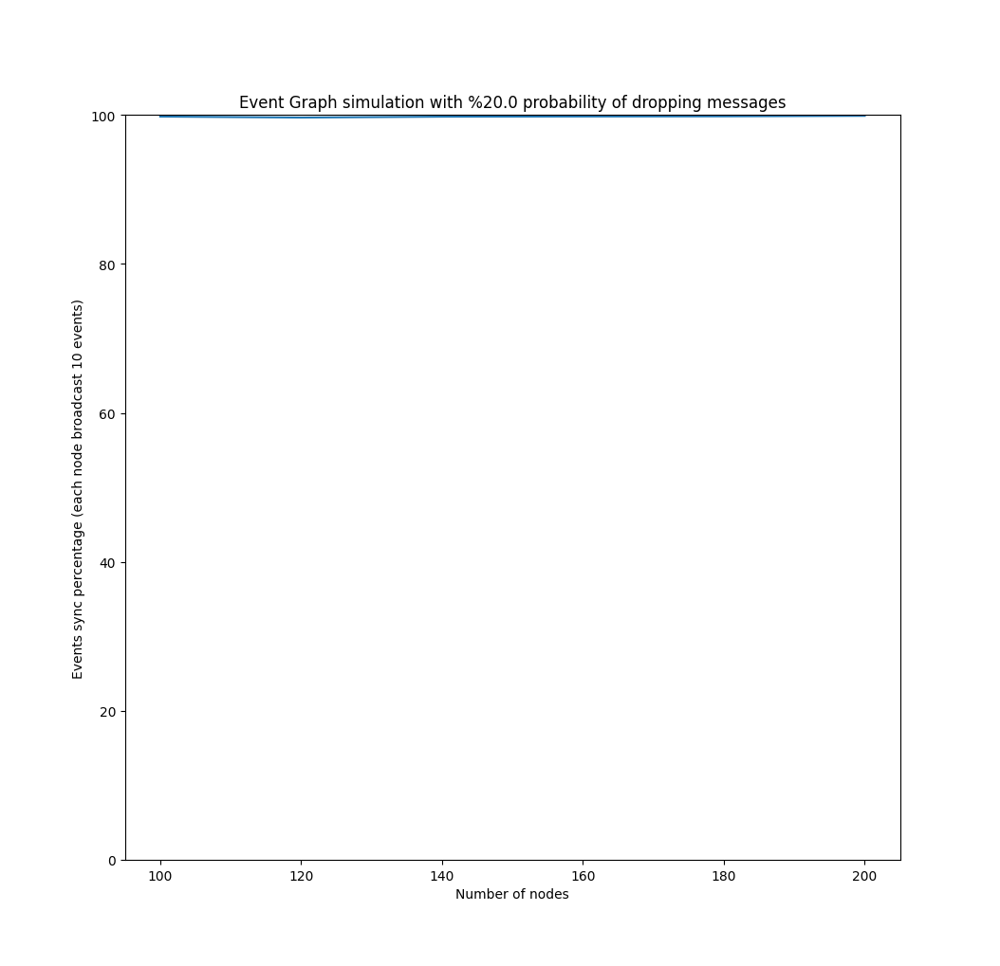
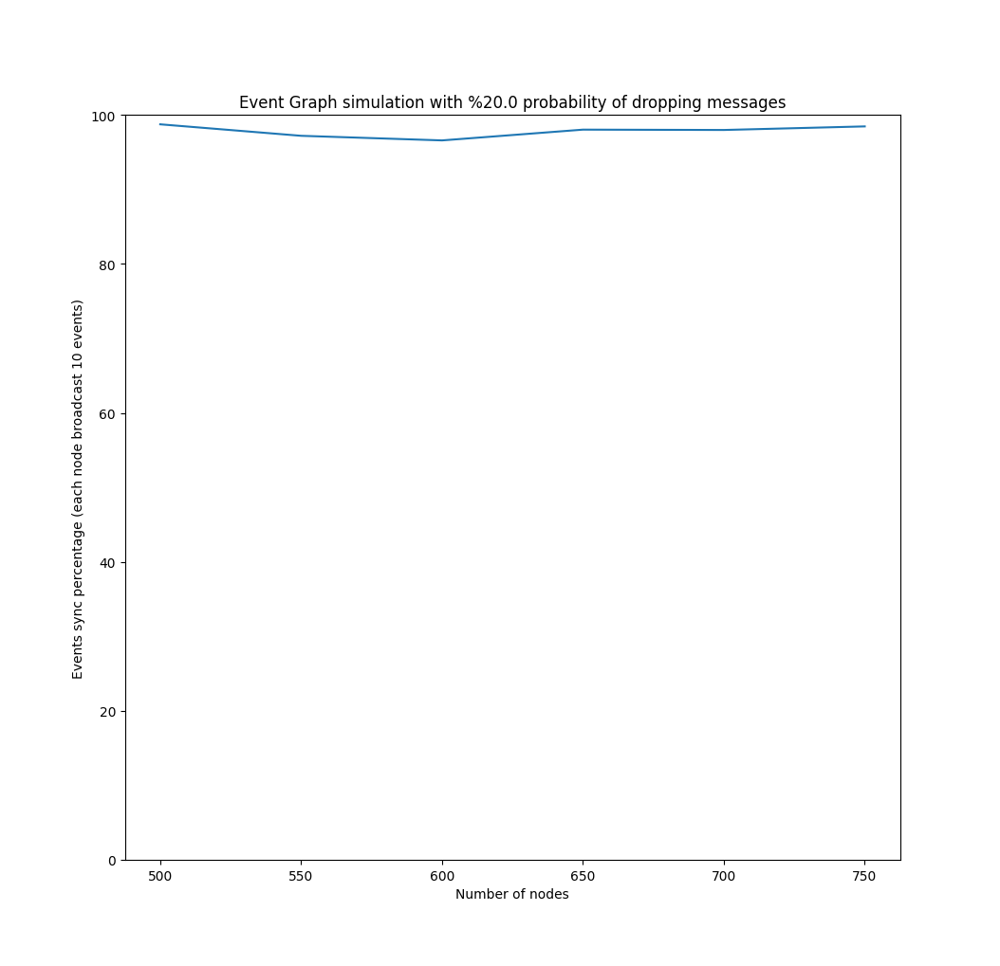
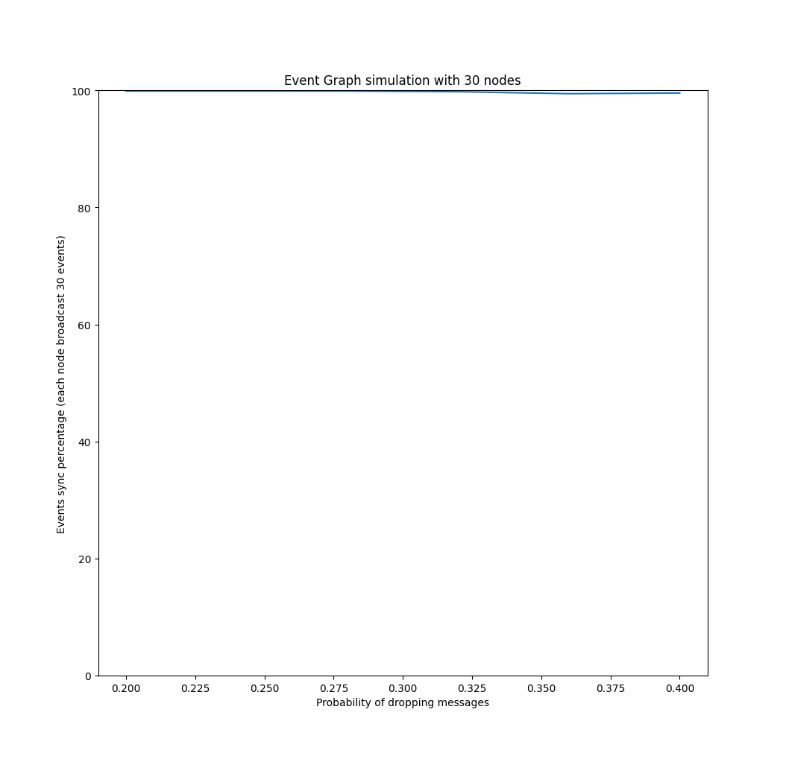
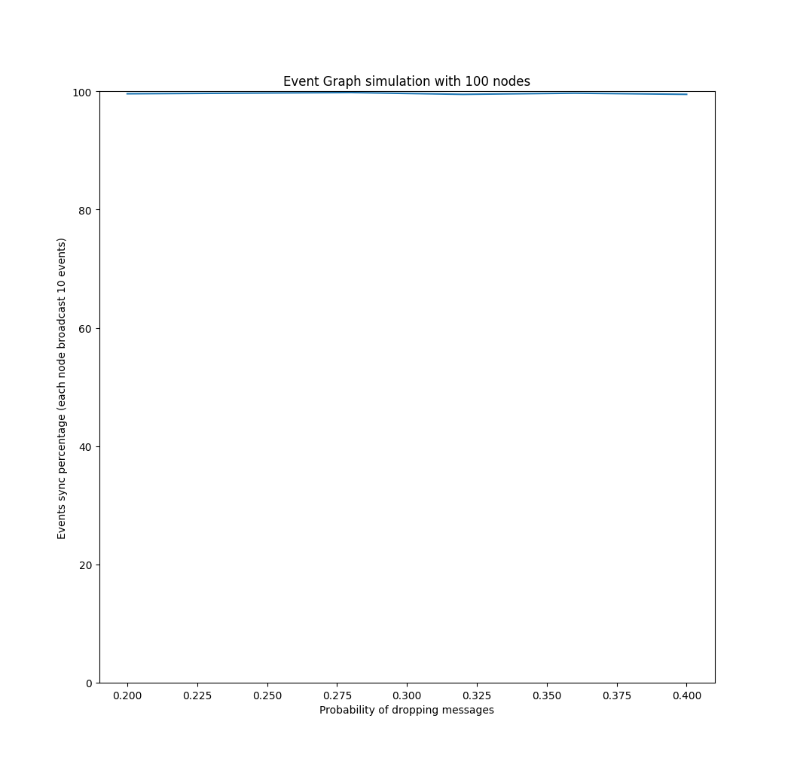
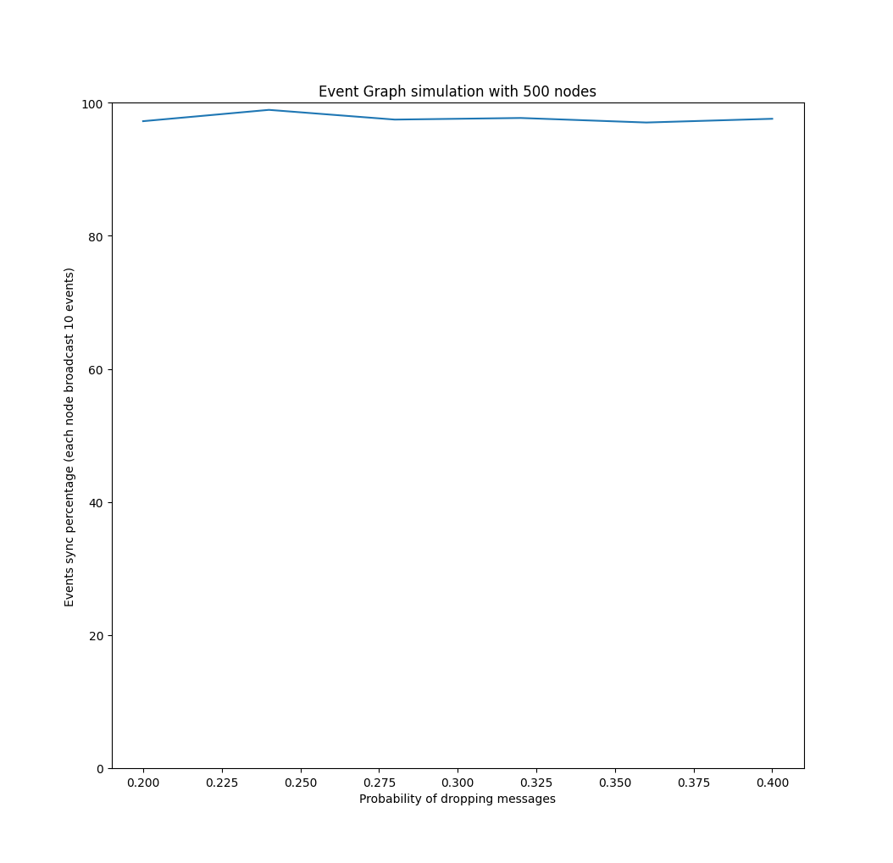
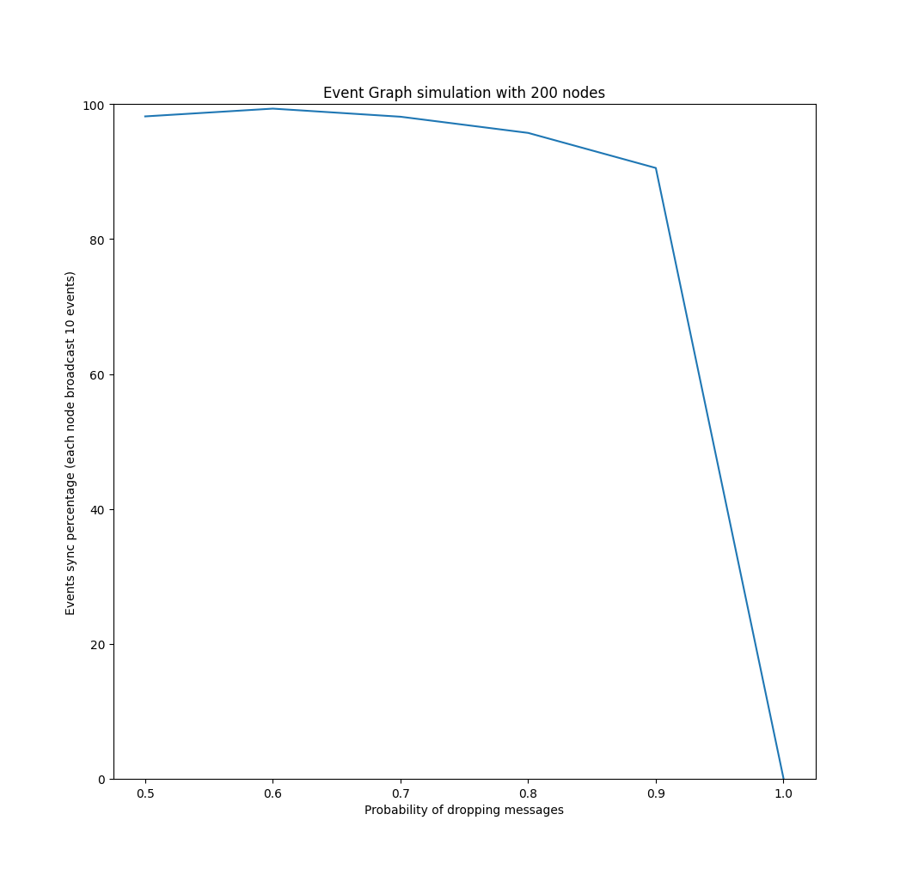

# Benchmarks

TODO: paragraph here on what is the event graph. what is the motivation

TODO: paragraph describing how it works from a high level

# Nodes increase with fixed probability of dropping messages  

TODO: description here of the graphs

# Increase probability of dropping messages with fixed number of nodes 

TODO: description here of the graphs

## The probability reach to 100% for  dropping messages 

TODO: description here of the graphs

